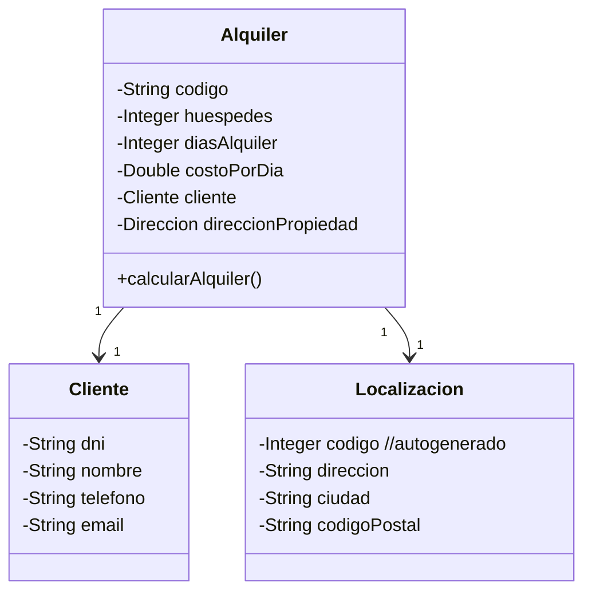

# Notas Clase 28/08 - Actividad Procesar Csv

# Enunciado Clase Práctica - Procesador de CSV

Una inmobiliaria necesita procesar una serie de alquieres que se realizaron en sus propiedades durante la temporada de verano, en diversas localidades de la Argentina que se reparte entre las provincias de Córdoba, Rio Negro, Mendoza y Buenos Aires.

Para poder llevar a cabo una serie de análisis estadísticos, se cuenta con un un archivo csv que se llama [alquileres_verarno.csv](https://www.notion.so/alquileres_verano.csv), el contenido de este archivo tiene por cada fila del mismo, la representacion del siguiente objeto.



En base a esto, realizar las siguiente tareas:

1. Importar el archivo provisto y generar un vector con todos los alquileres, repetando la estructura de clase
    
    > URL location = App.class.getResource("alquileres_verano.csv"); use esta linea para mapear el archivo desde la carpeta resources
    > 
2. Determinar la cantidad de alquileres que hay en Mendoza
3. Indicar el total que se recaudó por los alquileres
    
    > total = costoPorDia * diasAlquiler
    > 
4. Realizar los unit test que considere necesario

---

---

# Desarrollo

# Resumen de la Actividad (hasta punto 3)

### 1. Modelo de Clases (POO)

Creamos 3 clases principales para representar la información del CSV:

- **Cliente**: guarda `dni`, `nombre`, `telefono`, `email`.
- **Localizacion**: guarda `direccion`, `ciudad`, `codigoPostal` y un `codigo` autogenerado.
- **Alquiler**: guarda `codigo`, `huespedes`, `diasAlquiler`, `costoPorDia`, y además referencia a un `Cliente` y a una `Localizacion`.
    - Tiene un método `calcularAlquiler()` que devuelve `costoPorDia * diasAlquiler`.

> Usamos Lombok con @Data, @AllArgsConstructor, @NoArgsConstructor para no escribir a mano getters, setters y constructores.
> 

---

### 2. Lectura del CSV

- Ubicamos el archivo `alquileres_verano.csv` en **`src/main/resources/`** (convención de Maven).
- En `App.java`, usamos:
    
    ```java
    BufferedReader br = new BufferedReader(
        new InputStreamReader(App.class.getResourceAsStream("/alquileres_verano.csv"))
    );
    
    ```
    
- Ignoramos la primera fila (cabecera).
- Separamos cada línea con `split(";")`.
- Con esos valores instanciamos `Cliente`, `Localizacion` y `Alquiler`.
- Guardamos todos los objetos en una **lista (`ArrayList<Alquiler>`)**.

En criollo: cada fila del CSV → un objeto `Alquiler` completo → lo metemos en una lista para trabajar con todos juntos.

---

### 3. Procesamiento de Datos

Una vez que tenemos la lista de alquileres:

- **Cantidad en Mendoza**:
    
    Recorrer la lista y contar cuántos tienen `localizacion.ciudad = "Mendoza"`.
    
- **Total recaudado**:
    
    Recorrer la lista y acumular `alquiler.calcularAlquiler()`.
    

En código (simplificado):

```java
long enMendoza = alquileres.stream()
    .filter(a -> a.getDireccionPropiedad().getCiudad().equalsIgnoreCase("Mendoza"))
    .count();

double total = 0;
for (Alquiler a : alquileres) {
    total += a.calcularAlquiler();
}

```

---

📌 **En criollo**:

1. Diseñamos el modelo (clases).
2. Leímos el CSV y lo convertimos en objetos.
3. Con esos objetos ya podemos responder preguntas: “¿cuántos en Mendoza?” y “¿cuánto recaudamos en total?”.

---

## Codigo

```java
package com.ejemplo;

import java.io.BufferedReader;
import java.io.FileReader;
import java.net.URL;
import java.util.ArrayList;
import java.util.List;

public class App {
    public static void main(String[] args) {
        // lista donde se guardan los alquileres del csv
        List<Alquiler> alquileres = new ArrayList<>();

        try {
            // 1. buscamos el archivo csv
            URL location = App.class.getResource("/alquileres_verano.csv");

            // 2. abrmos un lector para leer linea por linea
            BufferedReader br = new BufferedReader(new FileReader(location.getPath()));

            String linea;
            // salteamos la primer fila (cabecera)
            boolean primera = true;

            // leemos el archivo
            while ((linea = br.readLine()) != null) {
                if (primera) {
                    // cambiamos a false para que no entre mas
                    // (significa que ya leimos la primera)
                    primera = false;
                    continue;
                }

                // 3. cortamos la linea en partes, separando por comas
                String[] campos = linea.split(";");

                // ajustamos ahora el orden en base a las columnas del csv real
                String codigo = campos[0].trim();
                String dniCliente = campos[1].trim();
                String nombreCliente = campos[2].trim();
                String telefonoCliente = campos[3].trim();
                String emailCliente = campos[4].trim();
                String direccionCasa = campos[5].trim();
                String ciudadCasa = campos[6].trim();
                String cpCasa = campos[7].trim();
                int huespedes = Integer.parseInt(campos[8]);
                int diasAlquiler = Integer.parseInt(campos[9]);
                double costoPorDia = Double.parseDouble(campos[10]);

                // construimos los Objetos de nuestro dominio a partir de los datos del csv
                // cliente (dni, nombre, telefono, email)
                Cliente cliente = new Cliente (dniCliente, nombreCliente, telefonoCliente, emailCliente);

                // localizacion (direccion, ciudad, codigoPostal)
                Localizacion localizacion = new Localizacion(direccionCasa, ciudadCasa, cpCasa);

                // alquiler (codigo, huespedes, diasAlquiler, costoPorDia, cliente, localizacion)
                Alquiler alquiler = new Alquiler(codigo, huespedes, diasAlquiler, costoPorDia, cliente, localizacion);

                alquileres.add(alquiler);
            }
        }
        catch (Exception e) {
            // si algo falla al leer, mostramos el error
            System.err.println("error leyendo el csv:" + e.getMessage());
            e.printStackTrace();
            return;
        }

        // probamos cuantos alquieres se cargaron
        System.out.println("alquileres cargados" + alquileres.size());

        // mostramos los primeros 3
        for (int i = 0; i < Math.min(3, alquileres.size()); i++) {
            System.out.println(" - " + alquileres.get(i));
        }

        //-------------------- Punto 2 y 3----------------------
        // calculamos el total recaudado de los alquileres
        double total = 0.0;
        for (Alquiler a: alquileres) {
            // usamos el metodo que ya tenemos
            total += a.calcularAlquiler();
        }
        System.out.println("total recaudado: $" + total);

        // alquileres que hay en mendoza
        long enMendoza = alquileres.stream()
                .filter(a -> a.getDireccionPropiedad().getCiudad().equalsIgnoreCase("Mendoza"))
                .count();
        System.out.println("Alquileres en Mendoza: " + enMendoza);
    }

    // =========================
    // Helpers de parseo seguro -------- NO ES NECESARIO
    // =========================

    /**
     * Intenta parsear un entero de forma segura.
     * - trim() remueve espacios
     * - si falla, retorna null en vez de lanzar excepción (para que puedas decidir qué hacer)
     */

    private static Integer parseIntSafe(String s) {
        try {
            return Integer.parseInt(s.trim());
        } catch (Exception e) {
            return null;
        }
    }

    /**
     * Intenta parsear un double de forma segura.
     * - Reemplaza coma por punto (por si el CSV viene con separador decimal ",")
     * - trim() remueve espacios
     * - si falla, retorna null
     */
    private static Double parseDoubleSafe(String s) {
        try {
            String normalizado = s.trim().replace(",", ".");
            return Double.parseDouble(normalizado);
        } catch (Exception e) {
            return null;
        }
    }

    // ---------- FIN HELPERS ----------------

}

```

---

---

# Cómo pensar un test (AAA)

- **Arrange (Preparar):** creo los objetos/datos de prueba.
- **Act (Actuar):** llamo a la función que quiero probar.
- **Assert (Afirmar):** verifico el resultado con `assert…`.

JUnit 5 usa:

- `@Test` para marcar un método como prueba.
- `Assertions.*` (import estático) para chequear cosas: `assertEquals`, `assertTrue`, `assertNotNull`, etc.
- Los tests viven en `src/test/java/...` y **no** se ejecutan en `main`. Los corre el runner (IntelliJ o `mvn test`).

---

# Tu test explicado y con comentarios

```java
package com.ejemplo;

// Importo la anotación @Test de JUnit 5 (Jupiter)
import org.junit.jupiter.api.Test;

// Import estático de TODOS los asserts: me permite escribir assertEquals(...)
// en lugar de Assertions.assertEquals(...)
import static org.junit.jupiter.api.Assertions.*;

import java.util.List;

public class ProcesadorAlquileresTest {

    // =========================
    // 1) TEST UNITARIO PURO (sin CSV)
    // Objetivo: probar la función totalRecaudado(...) con datos "armados a mano".
    // AAA:
    //  - Arrange: creo 2 alquileres con totales conocidos.
    //  - Act: llamo totalRecaudado(List.of(a1, a2)).
    //  - Assert: verifico que la suma sea la esperada.
    // =========================
    @Test // <- Esto le dice a JUnit que ejecute este método como test.
    void totalRecaudado_conDosAlquileres_esCorrecto() {
        // Arrange: creo el "cliente" y la "localización" comunes a ambos alquileres
        Cliente c = new Cliente("111", "Ana", "123", "a@a.com");
        Localizacion l = new Localizacion("Calle 1", "Mendoza", "5500");

        // Creo 2 alquileres con números fáciles de controlar:
        // a1: 3 días * $1000 = $3000
        Alquiler a1 = new Alquiler("A", 2, 3, 1000.0, c, l);
        // a2: 2 días * $1500 = $3000
        Alquiler a2 = new Alquiler("B", 4, 2, 1500.0, c, l);

        // Act: llamo a la función a testear
        double total = ProcesadorAlquileres.totalRecaudado(List.of(a1, a2));

        // Assert: comparo el resultado con el esperado (6000)
        // El "0.0001" es la tolerancia para doubles (tema de coma flotante)
        assertEquals(6000.0, total, 0.0001, "La suma debería ser 6000");
    }

    // =========================
    // 2) TEST UNITARIO PURO (sin CSV)
    // Objetivo: probar contarPorCiudad(...) ignorando mayúsc/minúsc.
    // AAA:
    //  - Arrange: creo 3 alquileres (2 "Mendoza" con distinto casing y 1 "Córdoba").
    //  - Act: llamo contarPorCiudad(lista, "MENDOZA") con la ciudad en MAYÚSCULAS.
    //  - Assert: espero 2.
    // =========================
    @Test
    void contarPorCiudad_ignoraMayusculasMinusculas() {
        // Arrange
        Cliente c = new Cliente("222", "Luis", "456", "l@l.com");
        // Uno con "Mendoza" normal
        Alquiler enMza1 = new Alquiler("X", 2, 1, 10.0, c, new Localizacion("Dir", "Mendoza", "5500"));
        // Otro con "Córdoba"
        Alquiler enCord = new Alquiler("Y", 2, 1, 10.0, c, new Localizacion("Dir", "Córdoba", "5000"));
        // Otro con casing raro "mEndoZa" para comprobar case-insensitive
        Alquiler enMza2 = new Alquiler("Z", 2, 1, 10.0, c, new Localizacion("Dir", "mEndoZa", "5500"));

        // Act: uso "MENDOZA" para forzar el caso insensible
        long cuantos = ProcesadorAlquileres.contarPorCiudad(List.of(enMza1, enCord, enMza2), "MENDOZA");

        // Assert
        assertEquals(2, cuantos, "Deberían contarse 2 en Mendoza");
    }

    // =========================
    // 3) TEST DE INTEGRACIÓN (con CSV real)
    // Objetivo: asegurarnos de que la carga real del archivo funciona y trae datos razonables.
    // AAA:
    //  - Arrange/Act: llamo cargar() (ya lee desde resources).
    //  - Assert: la lista no está vacía y algunos campos clave vienen válidos.
    // =========================
    @Test
    void cargar_desdeCSV_noVieneVacio_yCamposValidos() {
        // Act (también hace de Arrange, porque todo está dentro de cargar())
        List<Alquiler> lista = ProcesadorAlquileres.cargar();

        // Assert 1: debe traer al menos una fila
        assertTrue(lista.size() > 0, "La carga desde CSV debería traer filas");

        // Assert 2: algunos chequeos "sanity" en los primeros N elementos
        int N = Math.min(5, lista.size()); // reviso hasta 5 o lo que haya
        for (int i = 0; i < N; i++) {
            Alquiler a = lista.get(i);
            // No deberían venir nulos los objetos compuestos ni datos clave
            assertNotNull(a.getCliente(), "Cliente no debería ser null");
            assertNotNull(a.getDireccionPropiedad(), "Localizacion no debería ser null");
            assertNotNull(a.getCostoPorDia(), "costoPorDia no debería ser null");
            assertNotNull(a.getDiasAlquiler(), "diasAlquiler no debería ser null");

            // Valores mínimos esperables (defensa básica)
            assertTrue(a.getDiasAlquiler() >= 0, "diasAlquiler debería ser >= 0");
            assertTrue(a.getCostoPorDia() >= 0, "costoPorDia debería ser >= 0");
        }
    }

    // =========================
    // 4) TEST OPCIONAL (array/vector)
    // Objetivo: practicar que sé convertir List -> Alquiler[] y operar como "vector".
    // Además, comparo el resultado con la función "oficial" (contarPorCiudad) para validar.
    // =========================
    @Test
    void contarPorCiudad_usandoVectorArray() {
        // Arrange/Act: cargo la lista real
        List<Alquiler> lista = ProcesadorAlquileres.cargar();
        assertTrue(lista.size() > 0); // si no hay datos, no tiene sentido seguir

        // Transformo la List en array (vector) para cumplir con "vector" literal
        Alquiler[] vector = lista.toArray(new Alquiler[0]);

        // Recorro el array y cuento manualmente los de Mendoza (case-insensitive)
        int cont = 0;
        for (Alquiler a : vector) {
            if (a.getDireccionPropiedad().getCiudad().equalsIgnoreCase("Mendoza")) {
                cont++;
            }
        }

        // Assert: debe coincidir con el conteo de la función "oficial"
        long esperado = ProcesadorAlquileres.contarPorCiudad(lista, "Mendoza");
        assertEquals(esperado, cont, "El conteo con array debe coincidir con el de la List");
    }
}

```

---

## Puntos clave que te conviene recordar

- **¿Qué es un test unitario?**
    
    Un método que prueba **una pieza pequeña de lógica** de tu código (una función) con datos controlados, de forma **automática**.
    
- **¿Qué hace `@Test`?**
    
    Marca el método para que el runner de JUnit lo ejecute como prueba.
    
- **¿Qué es un assert?**
    
    Una **condición que debe cumplirse**. Si no se cumple, el test **falla** y te muestra el mensaje.
    
- **¿Por qué `0.0001` en `assertEquals` con `double`?**
    
    Los números en coma flotante pueden tener pequeñas imprecisiones; el “delta” acepta un margen.
    
- **Diferencia Unitario vs Integración**
    - *Unitario:* no depende de archivos ni red; vos armás los datos a mano.
    - *Integración:* prueba que distintas piezas funcionen juntas (por ej., leer el CSV real).
- **¿Dónde van?**
    
    En `src/test/java/...`. No se mezclan con tu código de producción en `src/main/java/...`.
    
- **Cómo leer un fallo**
    
    El runner te dice **qué assert falló**, **cuál era el esperado** y **cuál el actual**. Usá el mensaje para orientarte.
    

---

---

# Qué tipo de lectura hicimos

## 1) Lectura **con OpenCSV por *nombre de columna*** (no por índice)

Para el `cargar()` usamos **OpenCSV** con `CSVReaderHeaderAware`, que lee cada fila como un `Map<String,String>` donde **la clave es el nombre de la columna del header**. Esto nos permite acceder por `"ciudad"`, `"dni"`, `"costoPorDia"`, etc., y **no depender del orden** de las columnas del archivo【】【】.

Además, abrimos el archivo con `Files.newBufferedReader(...)` dentro de un **try-with-resources** para cerrar bien el recurso (tal como recomienda el apunte)【】.

Un esqueleto equivalente al que usamos en `cargar()` luce así:

```java
import com.opencsv.CSVReaderHeaderAware;
import java.nio.file.*;

public static List<Alquiler> cargar() {
    List<Alquiler> lista = new ArrayList<>();

    try (CSVReaderHeaderAware reader =
             new CSVReaderHeaderAware(Files.newBufferedReader(Path.of("alquileres.csv")))) {

        Map<String,String> fila;
        while ((fila = reader.readMap()) != null) {
            // 1) Leer strings por nombre de columna
            String codigo       = fila.get("codigo");
            String sHabit       = fila.get("habitaciones");
            String sDias        = fila.get("dias");
            String sCosto       = fila.get("costoPorDia");

            String dni          = fila.get("dni");
            String nombre       = fila.get("nombre");
            String telefono     = fila.get("telefono");
            String email        = fila.get("email");

            String direccion    = fila.get("direccion");
            String ciudad       = fila.get("ciudad");
            String cp           = fila.get("cp");

            // 2) Normalizar/validar y convertir números
            int    habitaciones = Integer.parseInt(sHabit.trim());
            int    dias         = Integer.parseInt(sDias.trim());
            double costoPorDia  = Double.parseDouble(sCosto.trim());

            // 3) Armar objetos compuestos del dominio
            Cliente      c = new Cliente(dni, nombre, telefono, email);
            Localizacion l = new Localizacion(direccion, ciudad, cp);
            Alquiler     a = new Alquiler(codigo, habitaciones, dias, costoPorDia, c, l);

            lista.add(a);
        }
    } catch (Exception e) {
        throw new RuntimeException("Error leyendo CSV de alquileres", e);
    }
    return lista;
}

```

- **Por qué esta variante:** el apunte muestra tres caminos:
    
    a) `Scanner`+`split` (básico),
    
    b) `BufferedReader` (control de charset, try-with-resources),
    
    c) **OpenCSV** (manejo de comillas/escapes y acceso por header).
    
    Elegimos (c) con header-aware porque tenemos **objetos compuestos** (`Cliente`, `Localizacion`) y nombres de campo claros; así evitamos enredos con índices y nos queda **código más legible y robusto**.
    

> Buenas prácticas del apunte aplicadas: try-with-resources y validar/trim antes de parsear números para esquivar NumberFormatException.
> 

---

# Cómo se conectan los tests con la lectura

- **Test 3 (integración)**: `cargar_desdeCSV_noVieneVacio_yCamposValidos()`
    
    Verifica que `cargar()` realmente **lee del CSV** y que los **objetos compuestos** (`Cliente`, `Localizacion`) y **campos numéricos** llegan válidos. Esto calza perfecto con la lectura **header-aware** + armado de objetos que te mostré.
    
- **Test 1 y 2 (unitarios puros, sin CSV)**: prueban la lógica de negocio:
    - `totalRecaudado(...)` suma `dias * costoPorDia` de cada `Alquiler`.
    - `contarPorCiudad(...)` cuenta alquileres por ciudad **ignorando mayúsc/minúsc**.
        
        Esto es exactamente lo que el apunte recomienda hacer una vez que ya tenés la lista cargada: **procesar con Streams o bucles claros** sobre la colección en memoria.
        

Implementación típica (coincide con lo que validan tus tests):

```java
// suma de (dias * costo) – versión Streams
static double totalRecaudado(List<Alquiler> lista) {
    return lista.stream()
        .mapToDouble(a -> a.getDiasAlquiler() * a.getCostoPorDia())
        .sum();
}

// conteo por ciudad, case-insensitive – versión Streams
static long contarPorCiudad(List<Alquiler> lista, String ciudad) {
    return lista.stream()
        .filter(a -> a.getDireccionPropiedad().getCiudad().equalsIgnoreCase(ciudad))
        .count();
}

```

> El apunte 11 justamente muestra cómo, después de mapear el CSV a objetos, explotás Streams/Collectors para cálculos, filtros, ordenamientos, etc. (p. ej., mapToInt/average, sorted/limit, groupingBy, joining).
> 

---

# Alternativas del apunte (por si las necesitás)

- **Scanner + split**: rápido para casos simples, todo JDK.
- **BufferedReader**: más control (charset UTF-8), también JDK puro.
- **CsvToBean + anotaciones**: OpenCSV mapea directo a POJOs; ideal si tus campos son “planos” (o si te tomás el trabajo de escribir convertidores).

En nuestro caso, como **`Alquiler` arma sub-objetos** (`Cliente`, `Localizacion`), la vía **header-aware + mapeo manual** quedó **más simple y controlable** que `CsvToBean`.

---

## TL;DR (en criollo)

- **Lectura usada:** OpenCSV **CSVReaderHeaderAware** + `Files.newBufferedReader(...)` (**try-with-resources**), leyendo **por nombre de columna** y armando **objetos compuestos** a mano.
- **Funciones clave:** `readMap()` para cada fila, `Map.get(...)`, `Integer.parseInt`, `Double.parseDouble`, `equalsIgnoreCase`, y luego **Streams** (`mapToDouble/sum`, `filter/count`) para la lógica que testean los unitarios.
- **Buenas prácticas aplicadas:** **try-with-resources**, **UTF-8**, **trim/validación** de numéricos.

Si querés, te reviso el `cargar()` real y te marco, línea por línea, dónde aplicar `trim`, qué campos conviene validar y cómo loguear filas inválidas sin tirar abajo toda la carga.