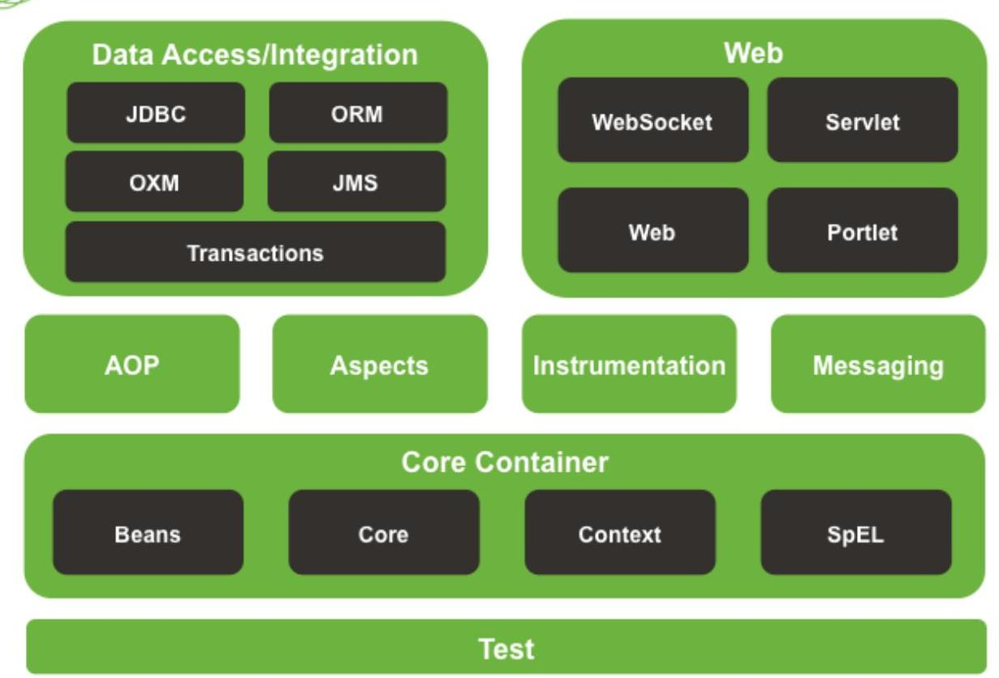
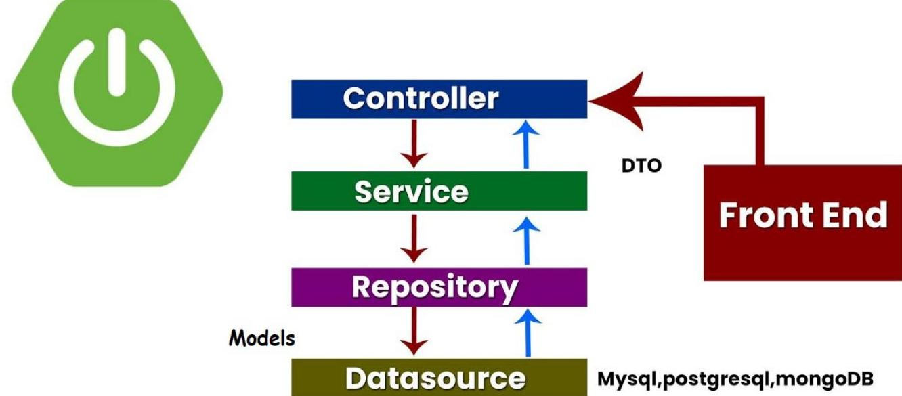
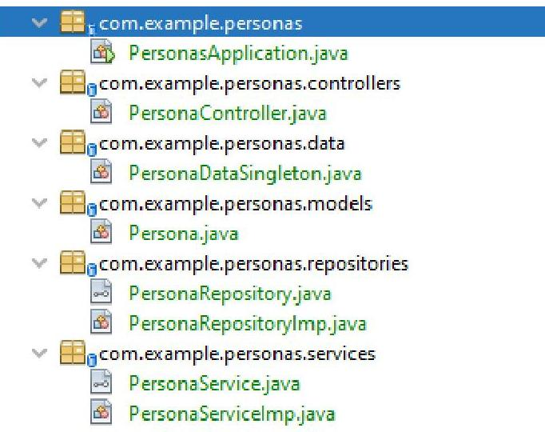

# Apunte 15 - Spring Framework 

Spring es un framework de código abierto que ha sido creado por miembros de la comunidad de código abierto y se ha convertido en un estándar ampliamente utilizado en el desarrollo de aplicaciones Java.

Spring se destaca por su capacidad para agilizar el proceso de desarrollo de aplicaciones, especialmente en el ámbito web. Aunque no es parte de la biblioteca estándar de Java, su popularidad entre los desarrolladores ha llevado a que sea considerado como un estándar de facto en la comunidad.

El enfoque principal de Spring es brindar herramientas que simplifiquen el desarrollo de aplicaciones Java en diferentes contextos. En particular, se ha destacado en el desarrollo web, tanto en la creación de sitios web basados en Java como en la construcción de servicios que exponen una API REST para ser consumida por un frontend desarrollado en otras tecnologías.

## Spring Framework Runtime



## Evolución del Modelo de Programación en Spring Framework

| Versión | Productor / <br> Configuración | Consumidor / Inyección | Modelo <br> dominante | Características clave |
| :--: | :--: | :--: | :--: | :--: |

| Versión |       Productor / Configuración       |        Consumidor / Inyección        |               Modelo dominante               |                       Características clave                        |
| :-----: | :-----------------------------------: | :----------------------------------: | :------------------------------------------: | :----------------------------------------------------------------: |
| $3 . x$ |      @Bean, configuración en XML      |              @Autowired              |               Síncrono clásico               |          DI tradicional, fuerte orientación a JavaConfig           |
| $4 . x$ |      Igual + soporte de eventos       |      @EventListener, @Autowired      |    Síncrono + <br> Event-driven opcional     |          Introducción de programación orientada a eventos          |
| $5 . x$ |   Mono, Flux <br> (Project Reactor)   |        Programación reactiva         |    Reactivo <br> (Reactor + <br> WebFlux)    |         APIs no bloqueantes, WebFlux, transición opcional          |
|   6.0   |  Declarativa, modular, @HttpExchange  |     Async-aware, @Autowired, DI      |      Reactivo, AOTaware, Observabilidad      |     Jakarta EE 9+, AOT, <br> GraalVM Native, tracing integrado     |
|   6.1   | Declarative HTTP <br> Client + Config | RestClient, @ConfigurationProperties |             Declarativo modular              |    Mejora en perfiles, soporte a HTTP declarativo más flexible     |
| $6.2+$  |   DSL declarativas, integración IA    |    Scoped Beans, dinámicos y AOT     | Modular + <br> Asincrónico + <br> Contextual | Consolidación de AOT, integración con IA y arquitecturas dinámicas |

# (7) Panorama futuro y versión $7 . x$ 

- Spring Framework 7.0 será la próxima gran versión, con hitos previstos a principios de 2025 y lanzamiento final hacia noviembre de 2025 :contentReference[oaicite:1](index=1).
- Requisitos y mejoras principales:
- Basado en Jakarta EE 11, adopta JDK 17-27+, y ofrece soporte nativo para Kotlin 2 :contentReference[oaicite:2](index=2).
- Estrategia de null-safety con anotaciones JSpecify :contentReference[oaicite:3](index=3).
- Apunta a eliminar soporte legado, como XML bean definitions y JSR-330 (e.g., @javax. inject. Inject) :contentReference[oaicite:4](index=4).

Este cambio representa una evolución decisiva hacia un modelo modular, declarativo, y optimizado para AOT, alineado con enfoques de desarrollo modernos (observabilidad, null-safety, APIs de cliente declarativas).

## Spring Container

El contenedor de Spring es uno de los puntos centrales de Spring, se encarga de crear los objetos, conectarlos entre sí e inicializar dichos objetos. Además controla los ciclos de vida de cada una de estas instancias mediante el patrón de Inyección de Dependencias (Dependency Injection ó DI). Si hay una función que caracteriza al core de Spring es justamente la implementación de la Inyección de Dependencias y la Inversión de Control y vamos a abordar el tema más adelante en el presente material.

---

El contenedor de Spring se puede configurar mediante archivos de configuración (.xml) o código java en clases especialmente dedicadas a tal fin. En los ejemplos siguientes se verán ambos mecanismos. Algunos de los componentes que se configuran en lo que se conoce como contexto de aplicación de Spring son:

- Servicios que se usarán en la aplicación
- Managed beans o beans definidos administrados por el contenedor, individualmente o a través de un introspección de clases.

Los beans son la manera que tiene Spring de denominar a los objetos Java que se encuentren (viven) en su contenedor principal. Los beans se pueden declarar mediante anotaciones en POJO's ( Plain Old Java Object , objetos normales de Java ) o mediante XML. El siguiente ejemplo muestra como declarar un bean mediante configuración XML:

```
<bean id="service" class="org.springframework.example.services.ServiceImpl">
    <property name="itemData" ref="itemData"></property>
</bean>
```

En este ejemplo se crea un bean con id_service, y se le indica donde se encuentra la clase, junto con la propiedad itemData haciendo referencia a un bean creado previamente cuyo id es lo que se indica en el atributo ref.

En el contenedor Spring se suelen crear y almacenar objetos de servicio, objetos de acceso a datos (DAO's), y objetos que nos permitan conectarnos con otras partes del sistema como un sistema de colas de mensaje, por ejemplo. No se suelen configurar los objetos de dominio de nuestra aplicación para que se encargue el contenedor de Spring, ese sería el trabajo de los DAO's o los repositorios (que ser verán en detalle más adelante).

# Inyección de dependencias 

El patrón de Inyección de Dependencias, complementado por el patrón de Inversión de Control (loC) es un patrón que tiene como finalidad conseguir un código más desacoplado, que facilita, entre otras cosas, tareas a la hora de hacer Tests y de cambiar partes del sistema en caso de que fuese necesario sin modificar el resto de los componentes. Esto se logra gracias a que los objetos son instanciados e inyectados por el framework (no se crean objetos mediante el operador new) según las relaciones de asociación definidas en las clases.

Tener el código desacoplado permite cambiar las dependencias en tiempo de ejecución basándose en cualquier factor que se considere, para ello se necesita un Inyector o Contenedor que sería el encargado de inyectar las dependencias correctas en el momento necesario.

Siguiendo el patrón de Inyección de Dependencias ( DI, Dependency Injection ) los componentes declaran sus dependencias, pero no se encargan de conseguirlas, ahí es donde entra el Contenedor de Spring, que será el encargado de conseguir e inyectar las dependencias a los objetos.

El siguiente código muestra un ejemplo de una clase que no usa el patrón de Inyección de Dependencia, además de estar fuertemente acopladas las dependencias, es la propia clase la que se encarga de crear una instancia de la dependencia:

---

```
public class GeneradorPlaylist {
    private BuscadorCanciones buscadorCanciones;
    public GeneradorPlaylist(){
        this.buscadorCanciones = new BuscadorCanciones();
    }
    //Resto de métodos de la clase
}
```

La clase GeneradorPlaylist necesita una instancia de la clase BuscadorCanciones para funcionar, por lo que la crea manualmente mediante el operador new. Para optimizar este código se puede pensar en que el propio Spring sea el responsable de crear el objeto, pudiendo a futuro cambiar la política de búsqueda de canciones, sin necesidad de cambiar la clase GeneradorPlaylist.

# Inyección de dependencias mediante constructor 

En el siguiente ejemplo se puede ver cómo el objeto declara sus dependencias en el constructor, podemos observar que no hay código que se encargue de buscar esa dependencia o crearla, simplemente la declara, esto ayuda a tener clases Java mucho más limpias a la vez que facilita el Testing, ya que en un entorno de Tests podríamos intercambiar ese objeto por un Mock sin cambiar el código ( mediante la configuración de Spring ).

```
public class GeneradorPlaylist {
    private BuscadorCanciones buscadorCanciones;
    public GeneradorPlaylist(BuscadorCanciones buscadorCanciones){
        this.buscadorCanciones = buscadorCanciones;
    }
    //Resto de métodos de la clase
}
```

Para informar a Spring cual es la dependencia que tiene que inyectar en GeneradorPlaylist se puede hacer mediante dos formas: XML o anotaciones. En el siguiente ejemplo se muestra cómo se configuraría mediante XML:

```
<bean id="buscadorCanciones" class="com.example.BuscadorCanciones">
    <bean id="generadorPlaylist" class="com.example.GeneradorPlaylist">
        <constructor-arg type="com.autentia.BuscadorCanciones"
ref="buscadorCanciones">
    </constructor-arg>
    </bean>
</bean>
```

---

La ubicación estándar para colocar los archivos de configuración XML en un proyecto de Spring es en el directorio "resources" (src/main/resources) del proyecto. Si se utiliza un sistema de construcción como Maven o Gradle, este directorio generalmente se considera como el directorio de recursos del proyecto.

Por ejemplo, si tu proyecto sigue la estructura típica de un proyecto Maven, el archivo XML debe colocarse en el siguiente directorio:

```
src
    \longleftarrow main
        \longleftarrow resources
            \longleftarrow application-context.xml (nombre del archivo puede variar)
```

Una vez colocado el archivo XML con la configuración de beans en el directorio de recursos, Spring podrá cargar y utilizar esta configuración cuando se inicialice la aplicación.

Es importante tener en cuenta que, a partir de versiones recientes de Spring, se ha fomentado el uso de configuraciones basadas en anotaciones (por ejemplo, usando clases de configuración con anotaciones @Configuration). Para que el contexto de aplicación de Spring cargue el archivo XML correctamente durante el arranque de la aplicación existen dos posibilidades: la clase ClassPathXmlApplicationContext o mediante configuraciones en el archivo de configuración principal de Spring (por ejemplo, "applicationContext.xml" o "spring-config.xml").

Por ejemplo, si se utiliza la clase ClassPathXmlApplicationContext, se puede hacer lo siguiente en tu código de inicio de la aplicación:

```
Copy code
import org.springframework.context.ApplicationContext;
import org.springframework.context.support.ClassPathXmlApplicationContext;
public class Main {
    public static void main(String[] args) {
        ApplicationContext context = new
ClassPathXmlApplicationContext("application-context.xml");
        // Aquí obtener y utilizar los beans definidos en el archivo XML.
    }
}
```

Es importante recordar que Spring buscará automáticamente los archivos de configuración en el classPath, que incluye el directorio "resources" por defecto. Si se coloca el archivo de configuración en otra ubicación, se deberá especificar la ruta correcta en la llamada a ClassPathXmlApplicationContext.

# Inyección de dependencias mediante «Setter» 

Spring también permite inyectar la dependencia mediante los Setter ( métodos set*()), cada forma de inyectar las dependencias tiene sus ventajas y sus desventajas.

---

Para indicarle a Spring que inyecte la dependencia mediante un método de establecimiento o set se utiliza la anotación @Autowired, tal como se muestra en e@@l siguiente código:

```
public class GeneradorPlaylist {
    @Autowired
    private BuscadorCanciones buscadorCanciones;
    public void setBuscadorCanciones(BuscadorCanciones buscadorCanciones){
        this.buscadorCanciones = buscadorCanciones;
    }
    //Resto de métodos de la clase
}
```

Mediante la anotación @Autowired se indica a Spring que se tiene que encargar de buscar un Bean que cumpla los requisitos para ser inyectado, en este caso el único requisito es que sea del tipo BuscadorCanciones, en caso de que hubiese más de un Bean que cumpliese esos requisitos se tendría que indicar cuál es el correcto.

Otro mecanismo que con frecuencia suele utilizarse para indicar a Spring que una clase tiene que se gestionada es mediante la anotación @Component. Es como indicarle a Spring que la clase será utilizada como un bean. Para más detalle visitar el siguiente Artículo interesante sobre inyeción de dependencias.

# Ejemplo de DI en una Aplicación de Consola con Spring 

## Parte 1: Aplicación de Consola sin Spring Boot

## Configuración del Proyecto

Incluye la dependencia de Spring Context en tu archivo pom.xml para un proyecto Maven:

```
<dependencies>
    <dependency>
        <groupId>org.springframework</groupId>
        <artifactId>spring-context</artifactId>
        <version>5.3.30</version>
    </dependency>
</dependencies>
```


## Definición de Clases y Servicios

Servicio de Saludo
import org.springframework.stereotype.Component;

---

```
@Component
public class SaludoService {
    public void saludar() {
        System.out.println("Hola desde Spring!");
    }
}
```


# Servicio de Despedida 

```
import org.springframework.stereotype.Component;
```

```
@Component
public class DespedidaService {
    public void despedir() {
        System.out.println("¡Adiós desde Spring!");
    }
}
```


## Configuración de Spring

Creamos una clase de configuración para escanear los componentes:

```
import org.springframework.context.annotation.ComponentScan;
import org.springframework.context.annotation.Configuration;
@Configuration
@ComponentScan(basePackages = "com.example") // Ajusta el paquete según tu
estructura
public class Configuracion {
}
```


## Clase Principal

``` java
import org.springframework.context.ApplicationContext;
import org.springframework.context.annotation.AnnotationConfigApplicationContext;
public class ConsolaApp {
    public static void main(String[] args) {
        // Inicializando el contexto de Spring
        ApplicationContext context = new
AnnotationConfigApplicationContext(Configuracion.class);
    // Inyección de dependencias por constructor
    SaludoService saludoService = context.getBean(SaludoService.class);
    saludoService.saludar();
    // Inyección de dependencias por atributo
    DespedidaService despedidaService =
context.getBean(DespedidaService.class);
    despedidaService.despedir();
    }
}
```


# Explicación 

En este ejemplo:

- SaludoService y DespedidaService son administrados por el contenedor de Spring.
- El contenedor de Spring se inicializa utilizando AnnotationConfigApplicationContext, y los servicios son obtenidos utilizando context.getBean.

Parte 2: Aplicación de Consola con Spring Boot

## Configuración del Proyecto con SpringBoot

Incluye las siguientes dependencias en tu archivo pom.xml:

```
<dependencies>
    <dependency>
        <groupId>org.springframework.boot</groupId>
        <artifactId>spring-boot-starter</artifactId>
        <version>3.3.4</version>
    </dependency>
</dependencies>
```


## Definición de Clases y Servicios con SpringBoot

Servicio de Saludo es igual

```
import org.springframework.stereotype.Component;
```

```
@Component
public class SaludoService {
    public void saludar() {
        System.out.println("Hola desde Spring!");
    }
}
```

Servicio de Despedida es igual

---

```
import org.springframework.stereotype.Component;
@Component
public class DespedidaService {
    public void despedir() {
        System.out.println("¡Adiós desde Spring!");
    }
}
```


# Clase Principal es un SpringBootApplication 

```
import org.springframework.beans.factory.annotation.Autowired;
import org.springframework.boot.CommandLineRunner;
import org.springframework.boot.SpringApplication;
import org.springframework.boot.autoconfigure.SpringBootApplication;
@SpringBootApplication
public class ConsolaApp implements CommandLineRunner {
private final SaludoService saludoService;
    // Inyección por atributo o propiedad
    @Autowired
    private DespedidaService despedidaService;
    // Inyección de dependencias a través del constructor
    public ConsolaApp(SaludoService saludoService) {
        this.saludoService = saludoService;
    }
    @Override
    public void run(String... args) {
        saludoService.saludar();
        despedidaService.despedir(); // Uso del servicio inyectado por propiedad
    }
    public static void main(String[] args) {
        SpringApplication.run(ConsolaApp.class, args);
    }
}
```


## Explicación usando SpringBoot

- La anotación @SpringBootApplication inicializa el contexto de Spring Boot.
- SaludoService se inyecta mediante el constructor, y DespedidaService se inyecta directamente en el atributo utilizando @Autowired.
- La implementación de CommandLineRunner permite que el método run sea ejecutado al inicio de la aplicación, lo cual es ideal para aplicaciones de consola.

---

# Ejecución 

En ambas versiones de la aplicación (con y sin Spring Boot), al ejecutarlas deberías ver el siguiente resultado en la consola:

```
Hola desde Spring!
¡Adiós desde Spring!
```

Este resultado confirma que ambos servicios han sido correctamente inyectados y utilizados en la aplicación de consola.

## Ejemplo de Ámbito (scope) de los Beans en Spring Framework

en una Aplicación de Consola

## Partimos del proyecto configurado con SpringBoot

En el archivo pom.xml, colocar las dependencias de Spring Boot:

```
<dependencies>
    <dependency>
        <groupId>org.springframework.boot</groupId>
        <artifactId>spring-boot-starter</artifactId>
        <version>3.3.4</version>
    </dependency>
</dependencies>
```


## Definición de los Scopes de los Beans

Spring define varios scopes para los beans, pero los más comunes son:

- Singleton: Un único bean se crea y se comparte en toda la aplicación. Cada vez que es inyectado se inyecta la misma instancia del objeto inicial.
- Prototype: Un nuevo bean se crea cada vez que se solicita. Cada vez que se inyecta se inyecta una nueva instancia.
- Request: (Relevante para aplicaciones web) Un bean se crea por cada solicitud HTTP.
- Session: (También relevante para aplicaciones web) Un bean se crea por cada sesión HTTP.

Para una aplicación de consola, nos enfocaremos en singleton y prototype porque request y session son específicos de aplicaciones web.

## Implementación de Ejemplos de Scopes

## 1. Bean con Scope Singleton (por defecto)

El ámbito singleton es el valor predeterminado en Spring. Un solo bean es compartido por toda la aplicación.

---

```
import org.springframework.context.annotation.Scope;
import org.springframework.stereotype.Component;
@Component
@Scope("singleton")
public class SingletonBean {
    public SingletonBean() {
        System.out.println("SingletonBean creado");
    }
    public void mensaje() {
        System.out.println("Método de SingletonBean");
    }
}
```


# 2. Bean con Scope Prototype 

Con el ámbito prototype, se crea una nueva instancia del bean cada vez que se solicita al contenedor de Spring.

```
import org.springframework.context.annotation.Scope;
import org.springframework.stereotype.Component;
@Component
@Scope("prototype")
public class PrototypeBean {
    public PrototypeBean() {
        System.out.println("PrototypeBean creado");
    }
    public void mensaje() {
        System.out.println("Método de PrototypeBean");
    }
}
```


## Clase Principal para Demostrar los Scopes

```
import org.springframework.beans.factory.annotation.Autowired;
import org.springframework.boot.CommandLineRunner;
import org.springframework.boot.SpringApplication;
import org.springframework.boot.autoconfigure.SpringBootApplication;
import org.springframework.context.ApplicationContext;
@SpringBootApplication
public class ScopeApp implements CommandLineRunner {
```

@Autowired

---

```
    private ApplicationContext context;
    public static void main(String[] args) {
        SpringApplication.run(ScopeApp.class, args);
    }
    @Override
    public void run(String... args) {
        // Obtener el bean con scope "singleton"
        System.out.println("Probando Singleton Scope:");
        SingletonBean singletonBean1 = context.getBean(SingletonBean.class);
        SingletonBean singletonBean2 = context.getBean(SingletonBean.class);
        System.out.println("¿Es el mismo bean? " + (singletonBean1 ==
singletonBean2));
        // Obtener el bean con scope "prototype"
        System.out.println("\nProbando Prototype Scope:");
        PrototypeBean prototypeBean1 = context.getBean(PrototypeBean.class);
        PrototypeBean prototypeBean2 = context.getBean(PrototypeBean.class);
        System.out.println("¿Es el mismo bean? " + (prototypeBean1 ==
prototypeBean2));
    }
}
```


# Explicación del uso de diferentes scopes 

- En el caso del bean SingletonBean, se verá un solo mensaje de "SingletonBean creado" en la consola, ya que el bean se crea una sola vez y se comparte.
- Para PrototypeBean, se verá el mensaje "PrototypeBean creado" dos veces, indicando que se crearon dos instancias distintas del bean cuando se solicitaron.


## Ejecución de ejemplo de diferentes scopes

Al ejecutar la aplicación, deberías ver una salida similar a la siguiente:

```
Probando Singleton Scope:
SingletonBean creado
¿Es el mismo bean? true
Probando Prototype Scope:
PrototypeBean creado
PrototypeBean creado
¿Es el mismo bean? false
```

Esta salida confirma que:

- El bean SingletonBean se crea una sola vez y se comparte.
- El bean PrototypeBean se crea cada vez que se solicita al contenedor de Spring.

---

# Conclusión 

Estos ejemplos muestran cómo cambia el comportamiento de los beans en función del scope que tienen. Puedes experimentar cambiando los scopes y observando el impacto que tienen en el ciclo de vida de los beans dentro de tu aplicación de consola Spring Boot.

## Funcionalidades de Spring

Spring ofrece una amplia gama de funcionalidades y herramientas prácticas que son de gran utilidad en diversos escenarios de desarrollo. Entre estas funcionalidades se incluyen:

- Desarrollo ágil de aplicaciones: Spring proporciona mecanismos que aceleran el desarrollo de aplicaciones Java, lo que permite ahorrar tiempo y esfuerzo en la implementación de características comunes.
- Acceso a datos simplificado: Spring facilita el acceso a bases de datos al proporcionar clases e interfaces que reducen la cantidad de código necesario para realizar operaciones de persistencia. Esto se logra utilizando tecnologías como JDBC (Java Database Connectivity) y JPA (Java Persistence API).
- Seguridad y autenticación: Spring ofrece herramientas y mecanismos para agregar capas de seguridad a nuestras aplicaciones, incluyendo autenticación y autorización. Esto permite proteger nuestros recursos y restringir el acceso a funciones o datos sensibles.
- Gestión de transacciones: Spring proporciona soporte para transacciones, lo que facilita la gestión y control de operaciones que deben ejecutarse en conjunto o de forma atómica.
- Integración con otros frameworks y tecnologías: Spring se integra fácilmente con otros frameworks y tecnologías populares en el ecosistema Java, como Hibernate, Thymeleaf, JUnit, entre otros. Esto permite aprovechar las ventajas de estos componentes adicionales y trabajar de manera conjunta.
- Arquitectura basada en microservicios: Spring se adapta bien a la arquitectura de microservicios, que consiste en desarrollar aplicaciones como un conjunto de servicios pequeños e independientes que se comunican entre sí. Esta arquitectura ofrece mayor flexibilidad, escalabilidad y facilidad de mantenimiento.

Una de las dificultades que se presentaba en el pasado al utilizar Spring era la configuración inicial del proyecto. Esto implicaba crear y configurar varios archivos, lo cual podía llevar mucho tiempo. Sin embargo, se ha desarrollado Spring Boot, una biblioteca que simplifica la configuración inicial y proporciona proyectos pre-configurados para escenarios comunes de desarrollo.

En resumen, Spring es un framework completo y versátil que ofrece una amplia gama de herramientas para el desarrollo de aplicaciones Java. Su uso está extendido en la comunidad de desarrolladores debido a su eficacia y facilidad de uso.

## Spring Boot en Detalle

Spring Boot es una extensión de Spring Framework, que se enfoca en simplificar la configuración y el uso de Spring en aplicaciones Web. Permite a los desarrolladores crear aplicaciones web rápidamente mediante la provisión de una serie de características pre-configuradas y pre-empaquetadas. Esto incluye características

---

como la gestión de dependencias, la configuración automática, la integración con bases de datos, la creación de servicios RESTful y la seguridad.

Spring Boot consta de varios módulos que ofrecen diferentes funcionalidades. A continuación, se presentan algunos sus principales módulos:

- Spring Boot Starter: este módulo proporciona un conjunto de dependencias para diferentes tipos de aplicaciones, como aplicaciones web, aplicaciones de datos, aplicaciones de seguridad, etc. El objetivo es reducir la configuración y permitir que los desarrolladores comiencen a escribir código rápidamente.
- Spring Boot Actuator: este módulo proporciona características de supervisión y administración de la aplicación, como el monitoreo de la salud de la aplicación, la exposición de métricas y estadísticas, y la posibilidad de realizar operaciones de gestión y monitoreo de la aplicación.
- Spring Boot CLI: es una herramienta de línea de comandos que permite a los desarrolladores crear y ejecutar aplicaciones Spring Boot de manera rápida y sencilla, sin la necesidad de configurar manualmente un proyecto.
- Spring Boot Data: este módulo proporciona una manera fácil y rápida de conectarse y trabajar con bases de datos a través de la capa de persistencia de Spring Data.
- Spring Boot Security: este módulo ofrece características de seguridad y autenticación para las aplicaciones, incluyendo la autenticación basada en formularios, la autenticación basada en tokens y la integración con proveedores de autenticación externos.
- Spring Boot Web: este módulo proporciona características para el desarrollo de aplicaciones web, como el soporte para la creación de servicios RESTful, la integración con servidores web embebidos, la administración de solicitudes y respuestas HTTP, y la gestión de errores.

Estos son solo algunos de los principales módulos de Spring Boot, existen otros que proporcionan diferentes funcionalidades para el desarrollo de aplicaciones.

En Resumen: Spring vs. Spring boot

| Característica | Spring Framework | Spring Boot |
| :-- | :-- | :-- |
| Configuración | Manual (XML, JavaConfig) | Auto-configuración |
| Arranque de proyecto | Gradual, desde cero | Proyecto listo para usar (starter) |
| Servidor embebido | Requiere configuración | Incluido por defecto (Tomcat) |
| Gestión de dependencias | Manual con Maven/Gradle | Starters predefinidos |
| Ideal para... | Aplicaciones configurables | APIs REST y microservicios rápidos |

# Spring Initializer 

A continuación, se mostrará el proceso para la creación de un nuevo proyecto utilizando Spring Boot. La forma más sencilla de hacerlo es mediante una herramienta llamada Spring Initializer, que se encuentra en el sitio web.

---

El sitio permite seleccionar varias opciones relacionadas con el proyecto para luego descargarlo preconfigurado listo para ejecutar. Las opciones que se nos presentan generalmente no son difíciles de elegir y, en muchos casos, ni siquiera es necesario cambiarlas. Las opciones son las siguientes:

1. Tipo de proyecto: Aquí se puede elegir entre dos gestores de dependencias/proyectos: Maven y Gradle. En este caso, se utilizará Maven, que es una opción muy popular y ampliamente utilizada en la comunidad de desarrollo de Spring.
2. Lenguaje de programación: Se puede elegir programar en Java, Kotlin o Groovy. Estos tres lenguajes son compatibles con la máquina virtual de Java (JVM), lo que significa que se pueden ejecutar en un entorno Java. En este caso, seleccionaremos Java, ya que es el lenguaje principal utilizado en esta asignatura.
3. Versión de Spring Boot: Aquí se debe seleccionar la versión de Spring Boot que deseamos utilizar. Es importante tener en cuenta que algunas versiones pueden estar en desarrollo y aún no ser completamente estables. Se recomienda utilizar la última versión estable disponible.

A continuación, se solicitan algunos datos relacionados con el proyecto:

1. Nombre del proyecto: Aquí se ingresa un nombre descriptivo para el proyecto. Puede ser el nombre del producto que se está desarrollando o cualquier nombre que se considere adecuado.
2. Descripción del proyecto: En este campo, se puede agregar una descripción breve del proyecto, que puede incluir su propósito, funcionalidad principal, etc.
3. Grupo (Group) y Artefacto (Artifact): Estos campos están relacionados con la estructura de paquetes del proyecto. El Grupo representa la organización o equipo que está desarrollando el proyecto, y el Artefacto es el nombre del producto o módulo dentro del proyecto. Estos nombres suelen seguir una convención basada en nombres de dominio inversos, como com.mi-empresa.mi-producto. Esta estructura de paquetes ayuda a mantener la organización y evitar conflictos de nombres con otras librerías o proyectos.
4. Otras opciones: por último se pueden elegir el tipo de empaquetado: Jar/War junto con la versión del JDK. Algo no menor que es posible seleccionar antes de descargar el proyecto son las dependencias a utilizar en el proyecto, siendo las más frecuentes:

- Spring Boot Dev Tools
- Spring Web
- Lombok
- Docker Compose Support

Es importante tener en cuenta que estas opciones de configuración se utilizan para generar el archivo de configuración de Maven (pom.xml) y la estructura de paquetes del proyecto. Sin embargo, muchos de estos detalles se pueden modificar posteriormente en el archivo de configuración o mediante la organización del proyecto.

Una vez completadas todas las opciones, haciendo clic en el botón "Generate" para descargar el proyecto pre-configurado en un archivo zip. Luego, se puede descomprimir el archivo y abrirlo en nuestro entorno de desarrollo preferido (por ejemplo, IntelliJ IDEA, Visual Code o Netbeans).

---

En resumen, utilizar Spring Initializer permite crear rápidamente un proyecto Spring Boot con una configuración inicial predefinida. Esto ahorra tiempo y esfuerzo al evitar la necesidad de configurar manualmente todas las dependencias y estructuras de proyecto desde cero.

Relación entre versiones de Spring Framework y Spring Boot (2020-2025)
A medida que evolucionan Spring Framework y Spring Boot, también lo hacen los requisitos de compatibilidad con Java, los enfoques de desarrollo y las herramientas que los acompañan. Esta tabla resume los hitos clave, versiones compatibles y requisitos mínimos.

| Año | Spring <br> Framework | Spring <br> Boot | Requiere <br> Java | Cambios clave / Hitos |
| :--: | :--: | :--: | :--: | :--: |
| 2020 | 5.2.x | $\begin{aligned} & 2.3 / \\ & 2.4 \end{aligned}$ | $\begin{aligned} & \text { Java 8- } \\ & 14 \end{aligned}$ | Preparación para Java 14/15. Mejora en GraalVM. Observabilidad con Micrometer. |
| 2021 | 5.3.x | $\begin{aligned} & 2.5 / \\ & 2.6 \end{aligned}$ | $\begin{aligned} & \text { Java 8- } \\ & 17 \end{aligned}$ | Última estable de Spring 5. Trabajo inicial en Spring Native. Avances en seguridad y datos. |
| 2022 | 6.0 | 3.0 | Java 17+ | Gran salto: adopción de Jakarta EE 9 (javax $\rightarrow$ jakarta). Soporte GraalVM. Micrometer Tracing. |
| 2023 | 6.1 | 3.1 | Java 17+ | Declarative HTTP Clients (@HttpExchange). Perfiles más flexibles. Trazabilidad distribuida. |
| 2024 | 6.2 (en desarrollo) | 3.2 | Java 17+ | RestClient reemplaza RestTemplate. IA, modularidad, HTTP declarativo mejorado. |
| 2025 | 6.2.x | 3.3 | Java 17+ | Mejoras AOT, rendimiento, integración de ProblemDetail, GraalVM consolidado. |
| Actual | 6.2.7 | 3.5.0 | Java 21+ | Mejoras AOT, rendimiento, integración de ProblemDetail, GraalVM consolidado. |

# Consideraciones clave 

- Java 17 es obligatorio a partir de Spring Boot 3.0 / Spring Framework 6.
- Jakarta EE 9+ implica migrar todas las referencias javax.* a jakarta.*.
- Spring Boot 2.x sigue funcionando con Java 8-11, pero ya está en etapa de mantenimiento.
- Spring Boot 3.x + Framework 6.x es el camino recomendado para nuevos desarrollos a partir de 2023.


## Referencias útiles:

- Spring Boot Compatibility Matrix (GitHub)
- Spring Releases


## Hola Mundo API con SpringBoot

Una vez descargado el proyecto, es posible ejecutarlo desde el IDE sin haber escrito ningún código hasta el momento. Este proyecto ya contiene cierto código, en particular el método main, que sirve como punto de entrada de la aplicación y se encargará de iniciar el proyecto.

---

Sin embargo, al intentar ejecutarlo, es posible encontrarse con un error que indica que no se puede encontrar la clase principal. Esto se debe a que es necesario indicarle a la herramienta de desarrollo, en este caso, NetBeans, cuál es la clase que contiene el método main. Esto es posible configurar desde las propiedades del proyecto. Haciendo clic derecho en el nombre del proyecto y luego en la opción "Properties". Desde la sección "Run", es posible definir un campo de entrada llamado "Main Class". Allí se debe indicar la clase que contiene el método main de la aplicación.

Una vez que hemos configurada correctamente la clase principal, se puede iniciar la aplicación y ver qué ocurre. Al ejecutarla, se puede observar en la salida del programa que se inicia un servidor web de Spring. Esto indica que el proyecto Spring Boot ya incluye un servidor web que se ejecutará junto con la aplicación. Por defecto, el servidor web estará configurado en el puerto 8080 y responderá a las solicitudes HTTP.

En este punto, si se intenta navegar a "localhost:8080" en un navegador, es posible que nos muestre un mensaje de error, ya que aún no se ha programado ninguna funcionalidad. Sin embargo, este mensaje de error es emitido por la aplicación Spring Boot y no por el navegador en sí. Esto demuestra que el servidor web integrado está funcionando correctamente.

Nota: siempre es buena práctica tener actualizado el JDK de Java a la última versión disponible para evitar problemas de versionado con la herramienta de gestión de dependencias y las configuraciones iniciales del proyecto.

# Rutas y Controladores 

Con la aplicación corriendo, se puede comenzar a programar los endpoints de la API. Un endpoint es un punto de conexión o acceso específico dentro de una API que permite la comunicación entre una aplicación y un servidor. Representa una URL (Uniform Resource Locator) única a la cual se pueden enviar solicitudes HTTP para interactuar con un recurso o realizar una acción específica. Cada endpoint suele estar asociado a un método HTTP, como GET, POST, PUT o DELETE, que define la acción a realizar en el recurso. Al acceder a un endpoint, se puede enviar información adicional, como parámetros de consulta, datos en el cuerpo de la solicitud o encabezados, para personalizar y controlar la operación realizada por la API.

En Spring, los endpoints se definen mediante métodos en clases conocidas como controladores (controllers). Para crear un endpoint, se necesita anotar un método con la anotación @RequestMapping o una de sus variantes, como @GetMapping, @PostMapping, etc.

Si por ejemplo se necesita crear un endpoint que responda con un mensaje de saludo "Hola, mundo". Para hacerlo, se crea una nueva clase de Java llamada HolaMundoController (siguiendo la convención CamelCase) y se anota con: @RestController. Esto indica que esta clase será un controlador de la API. Luego, se crea un método en esta clase, por ejemplo, saludar, que retorna un String con el mensaje "Hola, mundo".

Para especificar qué tipo de petición HTTP debe activar este endpoint, se utiliza una anotación como @GetMapping y se proporciona la URI en la cual estará disponible. Por ejemplo, podemos anotar el método con @GetMapping("/saludo"), lo que significa que este método responderá a las peticiones GET en la URI " <raiz del sitio>/saludo".

Una vez programado el endpoint, es posible iniciar la aplicación nuevamente y probarlo. Al navegar a "localhost:8080/saludo" en un navegador, se verá que se muestra el mensaje "Hola, mundo" que retorna el endpoint.

---

# Parámetros en URL 

Cuando se desarrollan APIs que exponen endpoints, es muy común que estos endpoints requieran datos adicionales, equivalentes a los parámetros de un método o una función. Para que un endpoint pueda recibir estos datos adicionales, existen varias formas de hacerlo.

En el caso de los endpoints asociados al verbo GET, existen dos lugares comunes donde se pueden incluir datos adicionales. Uno de ellos es como parte de la URL, es decir, como parte de la dirección de la URI. Por ejemplo, si se tiene un endpoint asociado a la URI "/hola", se podría incluir datos extra como parte de la dirección. Supongamos que se quiere que este mismo endpoint reciba el nombre del interlocutor, por ejemplo, "Jorge". Podemos incluir ese dato extra como parte de la dirección, como "/hola/Jorge".

Es importante tener en cuenta que no existirá un endpoint para cada posible nombre que pueda recibir. En su lugar, se puede indicar en el método que ésta porción variable de la dirección no es parte del identificador único del endpoint, sino más bien un parámetro variable que el método que atiende la petición desea recibir. Para lograr esto, se utiliza una notación especial en la URI, colocando la porción variable entre llaves. Por ejemplo, podríamos definir la URI como "/hola/\{nombre\}".

Luego, en el método que atiende este endpoint, por ejemplo, "saludar", se indica que se desea recibir un parámetro que contendrá el nombre de la persona a saludar. Esto se logra anotando el parámetro con la anotación @PathVariable, donde se especifica el nombre de la porción variable de la URI. Por ejemplo, se puede tener un método como public string saludar(@PathVariable String nombre).

De esta manera, cuando se realiza una petición a la URI "/hola/Jorge" (o cualquier otro nombre que se especifique), todo el contenido después de "/hola/" se almacenará automáticamente en el parámetro "nombre" del método. No es necesario que el programador realice ninguna otra operación, ya que esto ocurre automáticamente durante la ejecución.

Al reiniciar el servidor y realizar peticiones a este nuevo endpoint, se puede ver cómo el método que recibe el parámetro "nombre" reacciona de manera diferente y responde concatenando el contenido variable indicado en la URI con el saludo. Por ejemplo, si se hace una petición a "/hola/María", obtendremos como respuesta "¡Hola, María!".

De esta manera, se puede utilizar la inclusión de datos adicionales en la URI para hacer que los endpoints sean más flexibles y puedan recibir información específica en cada solicitud. Esto permite construir APIs más dinámicas y versátiles, adaptadas a las necesidades de los clientes que las consumen.

## Query string

En Spring boot, la anotación @RequestParam se utiliza para vincular los parámetros de una solicitud HTTP (comúnmente conocido como query string) a los parámetros de un método controlador. Esta anotación permite acceder y utilizar los valores de los parámetros proporcionados en la URL o en el cuerpo de la solicitud.

La anotación @RequestParam se puede aplicar a los parámetros de un método controlador y permite especificar diferentes atributos para personalizar cómo se vinculan los parámetros de la solicitud. Algunos de los atributos más comunes son:
value o name: Permite especificar el nombre del parámetro en la solicitud HTTP. Por defecto, la anotación asume que el nombre del parámetro del método coincide con el nombre del parámetro en la solicitud, pero

---

se puede utilizar esta opción para especificar un nombre diferente.
required: Un booleano que indica si el parámetro es requerido o no. Si se establece en true y no se proporciona el parámetro en la solicitud, se lanzará una excepción.
defaultValue: Permite establecer un valor predeterminado para el parámetro en caso de que no se proporcione en la solicitud.

A continuación se muestra un ejemplo de cómo se utiliza la anotación @RequestParam en un método controlador de Spring Boot:

```
@GetMapping("/saludar")
public String saludarConParam(@RequestParam("nombre") String nombre) {
    return "Hola" + nombre;
}
```

En este ejemplo, se espera que se proporcione el parámetro nombre. El valor del parámetro se vinculará automáticamente a la variable nombre. Si por ejemplo se ingresa:
http://localhost:8080/saludar?nombre=John
la parte ?nombre=John después del endpoint es la parte de la consulta de URL. Aquí, nombre=John indica que el valor del parámetro nombre es John.

Es importante tener en cuenta que estos parámetros enviados a través de la query string pueden ser opcionales. Si no se envía un parámetro determinado, llegará como una cadena vacía o nula al método correspondiente. Por lo tanto, es responsabilidad del método que maneje estos parámetros utilizarlos de manera adecuada y considerar su posible ausencia.

La elección entre el uso de path variables y query string depende del caso y la lógica del sistema. En general, se recomienda utilizar path variables cuando el dato es obligatorio y representa un recurso existente en el sistema, mientras que se utiliza query string cuando los parámetros son opcionales o su orden puede variar. Sin embargo, ambas formas permiten capturar y utilizar los parámetros de manera similar en el método que los recibe.

El código completo del proyecto se encuentra en Spring boot - Primer API

# Ejecutando endpoints 

Cuando se desarrolla una API REST, es común que no todos los endpoints estén programados para ser accedidos mediante el verbo GET. Por lo tanto, no es suficiente ejecutar las peticiones desde un navegador web, ya que los navegadores normalmente solo permiten enviar solicitudes GET. Para probar y simular otros verbos como POST, PUT, DELETE, entre otros, se utilizan herramientas como Bruno o Postman.

## Postman

---

# POSTMAN 

Postman es una herramienta muy utilizada que permite enviar peticiones HTTP de cualquier verbo y recibir las respuestas correspondientes. Con Postman, se puede probar cualquier verbo HTTP y realizar diferentes tipos de solicitudes a un servidor web. Es especialmente útil para simular una aplicación cliente y probar los diferentes endpoints de una API antes de implementar el frontend con tecnologías como React o Angular.

Para utilizar Postman, se crea una colección, que es un grupo de peticiones relacionadas a una API en particular. Dentro de la colección, se agregan las peticiones correspondientes a cada endpoint que se desea probar.

Cada petición en Postman se configura indicando el verbo HTTP, la URL del endpoint y otros parámetros necesarios. Al enviar la petición, Postman muestra la respuesta recibida, incluyendo el código de respuesta, las cabeceras y otra información técnica relevante.

En el caso de endpoints que utilizan el verbo POST, es común que se envíen datos en el cuerpo de la petición, en formato JSON, por ejemplo. Para recibir estos datos en el backend, se utiliza la anotación @RequestBody en el parámetro del método correspondiente. Esto permite que los datos enviados en el cuerpo de la petición se mapeen automáticamente a un objeto Java en el backend, facilitando su procesamiento.

En resumen, Postman es una herramienta muy útil para probar y simular peticiones HTTP con diferentes verbos en una API REST. Permite configurar y enviar peticiones de forma sencilla, mostrando las respuestas recibidas. Es especialmente útil cuando se necesitan enviar datos en el cuerpo de la petición, como en el caso de los endpoints que utilizan el verbo POST.

## Bruno


---

Bruno es un asistente de desarrollo que facilita la creación y gestión de aplicaciones backend. Con Bruno, los desarrolladores pueden configurar rápidamente su entorno de trabajo y manejar diferentes componentes de sus aplicaciones de forma eficiente. Es especialmente útil para optimizar el proceso de desarrollo y ayudar a los equipos a mantenerse organizados durante todo el ciclo de vida del software.

Para utilizar Bruno, los desarrolladores configuran un proyecto que agrupa todas las dependencias y configuraciones necesarias para su aplicación. Dentro de este proyecto, se pueden definir los servicios, controladores y modelos que componen la lógica del backend.

Cada componente en Bruno se configura especificando sus propiedades y relaciones, lo que permite una integración fluida entre los diferentes elementos de la aplicación. Al ejecutar el proyecto, Bruno proporciona retroalimentación instantánea, incluyendo mensajes de error, advertencias y otras informaciones relevantes que ayudan a los desarrolladores a identificar y resolver problemas rápidamente.

En el caso de los servicios que interactúan con bases de datos, es común que se utilicen patrones de diseño como repositorios para manejar la persistencia de datos. Esto permite que los datos se gestionen de forma eficiente y se integren fácilmente con los objetos Java en la aplicación, simplificando así el proceso de desarrollo.

En resumen, Bruno es una herramienta valiosa para desarrolladores que buscan mejorar su flujo de trabajo al crear aplicaciones backend. Permite configurar y gestionar proyectos de manera sencilla, ofreciendo una interfaz amigable y funcionalidades que optimizan el proceso de desarrollo y despliegue.

# Ejemplo de API REST con SpringBoot 

A continuación se presenta un ejemplo de evolución de una aplicación de consola a una API REST utilizando Spring Boot. Este ejemplo incluirá un servicio de healthCheck, un contador de visitas, y demostrará las diferencias entre los scopes de los beans: singleton, prototype, request, y session.

## Configuración del Proyecto web con Springboot

Se debe incluir la dependencia de Spring Web en el archivo pom.xml:

```
<dependencies>
    <dependency>
        <groupId>org.springframework.boot</groupId>
        <artifactId>spring-boot-starter</artifactId>
    </dependency>
    <dependency>
        <groupId>org.springframework.boot</groupId>
        <artifactId>spring-boot-starter-web</artifactId>
    </dependency>
</dependencies>
```


## Definición de los Scopes de los Beans en el Servidor

## 1. Bean con Scope Singleton en el Servidor

---

El bean VisitCounterSingleton mantendrá un conteo total de visitas en toda la aplicación.

```
import org.springframework.context.annotation.Scope;
import org.springframework.stereotype.Component;
@Component
@Scope("singleton")
public class VisitCounterSingleton {
    private int count = 0;
    public int increment() {
        return ++count;
    }
}
```


# 2. Bean con Scope Prototype en el Servidor 

El bean VisitCounterPrototype representará un contador que se resetea cada vez que se crea una nueva instancia.

```
import org.springframework.context.annotation.Scope;
import org.springframework.stereotype.Component;
@Component
@Scope("prototype")
public class VisitCounterPrototype {
    private int count = 0;
    public int increment() {
        return ++count;
    }
}
```


## 3. Bean con Scope Request

El bean VisitCounterRequest contará las visitas por cada solicitud HTTP.

```
import org.springframework.context.annotation.Scope;
import org.springframework.stereotype.Component;
@Component
@Scope("request")
public class VisitCounterRequest {
    private int count = 0;
    public int increment() {
        return ++count;
```

---

# 4. Bean con Scope Session 

El bean VisitCounterSession mantendrá un conteo de visitas por cada sesión HTTP.

```
import org.springframework.context.annotation.Scope;
import org.springframework.stereotype.Component;
@Component
@Scope("session")
public class VisitCounterSession {
    private int count = 0;
    public int increment() {
        return ++count;
    }
}
```


## Controlador de la API REST

El controlador VisitController manejará las peticiones de salud y el conteo de visitas.

```
import org.springframework.beans.factory.annotation.Autowired;
import org.springframework.web.bind.annotation.GetMapping;
import org.springframework.web.bind.annotation.RestController;
@RestController
public class VisitController {
    @Autowired
    private VisitCounterSingleton visitCounterSingleton;
    @Autowired
    private VisitCounterPrototype visitCounterPrototype;
    @Autowired
    private VisitCounterRequest visitCounterRequest;
    @Autowired
    private VisitCounterSession visitCounterSession;
    @GetMapping("/health")
    public String healthCheck() {
        return "API is running";
    }
    @GetMapping("/visit/singleton")
```

---

```
    public int getSingletonVisitCount() {
        return visitCounterSingleton.increment();
    }
    @GetMapping("/visit/prototype")
    public int getPrototypeVisitCount() {
        return visitCounterPrototype.increment();
    }
    @GetMapping("/visit/request")
    public int getRequestVisitCount() {
        return visitCounterRequest.increment();
    }
    @GetMapping("/visit/session")
    public int getSessionVisitCount() {
        return visitCounterSession.increment();
    }
}
```


# Clase Principal de la API 

```
import org.springframework.boot.SpringApplication;
import org.springframework.boot.autoconfigure.SpringBootApplication;
@SpringBootApplication
public class ApiRestApp {
    public static void main(String[] args) {
        SpringApplication.run(ApiRestApp.class, args);
    }
}
```


## Ejecución de la API

1. Arrancar la aplicación: Ejecutar la clase ApiRestApp.
2. Probar el EndPoint de Health Check:

- Realizar una petición GET a http://localhost:8080/health.

3. Contar visitas:

- Realizar múltiples peticiones a cada uno de los siguientes endpoints para observar el conteo:
- GET /visit/singleton para el contador de singleton.
- GET /visit/prototype para el contador de prototype.
- GET /visit/request para el contador de request.
- GET /visit/session para el contador de session.


## Observaciones

- Singleton: El contador total se incrementa y se mantiene a lo largo de la aplicación.

---

- Prototype: Cada solicitud crea un nuevo contador que se incrementa independientemente.
- Request: Se reinicia el contador para cada nueva solicitud HTTP.
- Session: El contador se reinicia al iniciar una nueva sesión, manteniéndose hasta que la sesión termine.

Cuando se ejecuta una aplicación Spring Boot que actúa como un servidor embebido, el servidor subyacente (por defecto, Tomcat) se inicia automáticamente y comienza a escuchar en un puerto específico, generalmente el puerto 8080. Aquí se explica cómo evidenciar la existencia de este servidor y cómo interactuar con él:

# Evidenciar la Existencia del Servidor Subyacente 

1. Ejecutar la Aplicación: Al ejecutar la clase principal (ApiRestApp en el ejemplo anterior), se inicia el servidor embebido. En la consola, deberías ver una salida similar a la siguiente:

Tomcat started on port(s): 8080 (http) with context path ''

Esto confirma que el servidor Tomcat se ha iniciado y está escuchando en el puerto 8080.

## 2. Interacción a través de un Navegador o Herramienta de Pruebas:

- Abre un navegador web o utiliza una herramienta como Postman o cURL.
- Realiza una solicitud HTTP a la URL del servidor. Por ejemplo, accede a http://localhost:8080/health en tu navegador. Deberías ver una respuesta indicando que la API está en funcionamiento.


## Modificar la Configuración del Servidor Subyacente

1. Configuración de Puertos: Para cambiar el puerto por defecto (8080), se puede modificar el archivo application.properties o application.yml en el directorio src/main/resources. Por ejemplo:
application.properties:
server.port=9090
application.yml:
server:
port: 9090

Después de hacer este cambio, el servidor escuchará en el nuevo puerto (9090) cuando se vuelva a ejecutar la aplicación.

## Interactuar con el Servidor

1. Herramientas de Monitoreo: Se pueden utilizar herramientas como Spring Boot Actuator para interactuar y monitorear el servidor. Actuator proporciona varios endpoints útiles para verificar el

---

estado de la aplicación y el servidor. Para agregar Actuator, se debe incluir la siguiente dependencia en el pom.xml:

```
<dependency>
    <groupId>org.springframework.boot</groupId>
    <artifactId>spring-boot-starter-actuator</artifactId>
</dependency>
```

Con Actuator habilitado, se pueden acceder a endpoints adicionales, como /actuator/health para verificar la salud del servidor y /actuator/info para obtener información sobre la aplicación.
2. Terminal o Consola: Mientras la aplicación está en ejecución, la consola mostrará información sobre las peticiones y respuestas, así como cualquier error que pueda ocurrir. Esto es útil para depurar y verificar el comportamiento del servidor.

# En resumen allí hay un servidor y no es el propio Spring 

- Al ejecutar la aplicación, el servidor Tomcat se inicia y escucha en el puerto configurado.
- Se puede cambiar la configuración del servidor mediante el archivo application.properties o application.yml.
- Se pueden agregar funcionalidades de monitoreo y gestión a través de Spring Boot Actuator para interactuar con el servidor y verificar su estado.

Este enfoque facilita la interacción con el servidor y la personalización de la configuración para satisfacer las necesidades específicas de la aplicación.

## Resumen

Este ejemplo muestra cómo implementar una API REST simple utilizando Spring Boot, al mismo tiempo que se demuestran los diferentes scopes de los beans y sus comportamientos en el contexto de una aplicación web. Esto permite observar claramente las diferencias entre los diversos tipos de contadores en función del scope utilizado y brinda contacto con el servidor que subyacente en las aplicaciones Spring Web que configuramos a través de SpringBoot.

## Servicios y Repositorios

En el desarrollo de sistemas con cierta complejidad, es recomendable organizar las clases siguiendo algún criterio para mantener una estructura clara y modular. Una arquitectura comúnmente utilizada es la arquitectura en capas.

En esta arquitectura, se divide la responsabilidad en diferentes capas y se organizan las clases en paquetes según su funcionalidad. A continuación, se describen las capas y su propósito principal:

- Capa de Controllers: Esta capa se encarga de manejar las solicitudes de la API y de interactuar con los clientes. Aquí se definen los controladores (RestController) que reciben las solicitudes HTTP y las dirigen a las capas correspondientes.

---

- Capa de Models: En esta capa se encuentran las clases que representan los objetos de entidad del sistema. Estas clases contienen propiedades y métodos relacionados con los datos que serán manipulados. Por lo general, estas clases se corresponden con las tablas de la base de datos y se utilizan para almacenar y recuperar datos.
- Capa de Repositories: En esta capa se definen los repositorios, que son responsables de interactuar con la base de datos. Aquí se implementan operaciones como guardar, actualizar, buscar y eliminar registros en la base de datos. Los repositorios se comunican con la capa de servicios para proporcionar o recibir datos.
- Capa de Services: En esta capa se encuentra la lógica de negocio del sistema. Aquí se definen los servicios que encapsulan la lógica y operaciones complejas. Los servicios utilizan los repositorios para acceder a los datos y realizar las operaciones requeridas. También se pueden aplicar reglas de validación, cálculos y otras operaciones específicas del dominio.

La comunicación entre las capas se realiza de la siguiente manera: los controladores (Controllers) reciben las solicitudes de los clientes y se comunican con los servicios (Services) correspondientes. Los servicios utilizan los repositorios (Repositories) para acceder a los datos y realizar operaciones en la base de datos, tal como se muestra en la siguiente imagen:

# Spring Boot 



Esta estructura en capas permite una separación clara de responsabilidades y facilita el mantenimiento y la evolución del sistema. Además, permite reemplazar o modificar una capa sin afectar el resto del sistema, lo que brinda flexibilidad y escalabilidad.

Cabe mencionar que esta es una arquitectura general y cada desarrollo puede adaptarla según sus necesidades y requisitos específicos. En la imagen la comunicación hacia el frontend es mediante objetos planos de Java llamados DTOs que sirven para recibir y transportar datos desde la API. También existen otras arquitecturas y patrones de diseño que pueden ser utilizados en diferentes contextos.

## Caso de aplicación: Personas

---

A continuación se presenta el desarrollo de una API REST con Spring boot que permite gestionar el listado de personas registradas a un evento. Para ello será necesario definir:

- un esquema: Persona con los siguientes datos: idPersona (Integer), nombre (String), fechaNacimiento (Date) y esExtranjero(Boolean).
- los siguientes endpoints:
- POST /personas:
- GET /personas:
- GET /personas/ $(i d)$ :

La descripción de la API mediante Swagger se muestra en el siguiente link
En este caso los datos de personas persistirán en memoria utilizando las herramientas y técnicas abordadas en la semana 3.

La estructura del proyecto se muestra en la siguiente imagen:


Puedes ver en acción la documentación Swagger generada automáticamente en la ruta:
http://localhost:8080/swagger-ui.html
Cabe mencionar que las personas serán persistidas en una estructura HashMap<int, Persona>dentro de la clase PersonaDataSingleton. En esta clase se implementa el patrón Singleton para garantizar solo una única instancia de almacenamiento de los datos que será compartida por los componentes de la aplicación.

El código completo del proyecto se encuentra en Spring boot - Personas API.