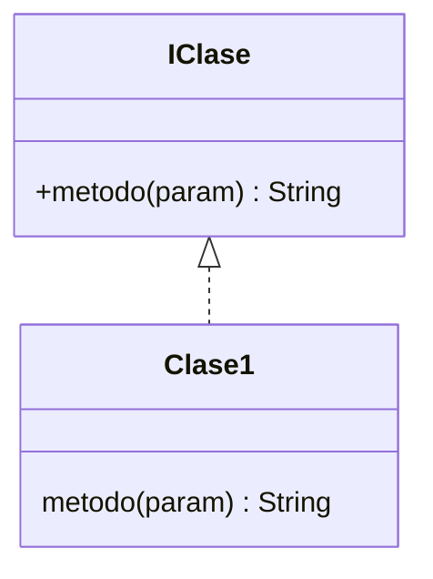
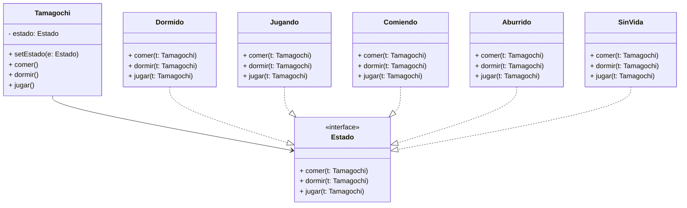
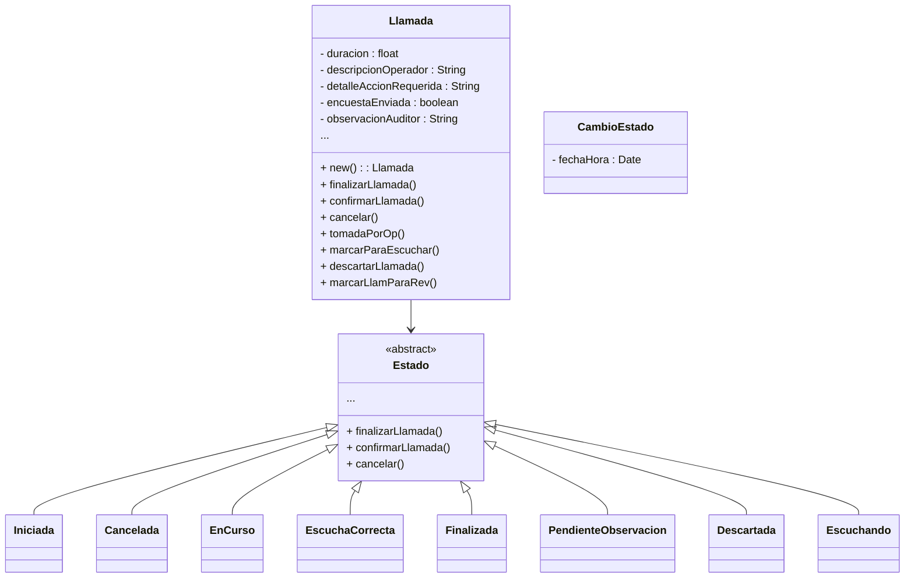

Pagina importante -> https://refactoring.guru/design-patterns/catalog

# Patrones de diseño

- Solucion probada para problemas recurrentes
- La idea es no reinventar la rueda, identificar el problema y aplicar el patron
- Aportan soluciones para determinados problemas de diseño

### Elementos principales
- nombre
- problema
- solucion
- consecuencias

### A que ayudan?
- Favorecer el rehuso
- dos mecanimos
	- Caja blanca -> Herencia, rehuso de codigo -> entramos dentro del codigo
		Caja blanca porque es visible, el hijo conoce completamente lo que tiene el padre y puede agregar codigo
	- Caja negra -> Composicion, agregacion, asociacion -> rehuso de definiciones: nombres de metodos y parametros (delegacion)
		Poder definir un conjunto de metodos sin realmente saber que clase es la que implementa. Hablamos de una interfaz como tal 
	
Priorizamos el uso de la relacion de **Realizacion**, sobre la **Herencia**, lacial nos permite definir interfaces, permitiendo programar hacia la interfaz y no hacia la imprementacion, para darle transparencia al cliente

### Como se implementa una interfaz?


La interfaz es caja negra, porque el cliente sabe qué métodos existen (la firma), pero no sabe ni le importa cómo están implementados. Lo único que le interesa es que cumpla el contrato definido en la interfaz.

## Clasificacion de patrones

| Ámbito | Creación                                           | Estructura                                                            | Comportamiento                                                                                            |
| ------ | -------------------------------------------------- | --------------------------------------------------------------------- | --------------------------------------------------------------------------------------------------------- |
| Clase  | Factory Method                                     | Adapter                                                               | Interpreter · Template Method                                                                             |
| Objeto | Abstract Factory · Builder · Prototype · Singleton | Adapter · Bridge · Composite · Decorator · Facade · Flyweight · Proxy | Chain of Responsability · Command · Iterator · Mediator · Memento · Observer · State · Strategy · Visitor |
- **Creación**: resuelven problemas referidos a la creación de objetos.  
- **Estructura**: combinan clases para resolver estructuras complejas o clases incompatibles y/o se agrega funcionalidad a la clase.  
- **Comportamiento**: resuelven el algoritmo y distribución de responsabilidades entre clases.  

## Patron State

### Ejemplo del Tamagochi

![[Pasted image 20250916091906.png]]

Diagrama de clases del patron State aplicado con una clase para cada estado



Armo una **interfaz/abstracta `Estado`** y **una clase por estado**: `Dormido`, `Jugando`, `Comiendo`, `Aburrido`, `SinVida`.
El **contexto** es `Tamagotchi`, que delega en su estado actual.

```java
// ====== Contrato común de todos los estados ======
abstract class Estado {
    // Acciones posibles en el dominio
    void dormir(Tamagotchi ctx)  { accionInvalida(ctx, "dormir"); }
    void jugar(Tamagotchi ctx)   { accionInvalida(ctx, "jugar"); }
    void comer(Tamagotchi ctx)   { accionInvalida(ctx, "comer"); }
    void aburrir(Tamagotchi ctx) { accionInvalida(ctx, "aburrir"); }
    void morir(Tamagotchi ctx)   { ctx.setEstado(new SinVida()); System.out.println("💀 Sin vida"); }

    protected void accionInvalida(Tamagotchi ctx, String accion) {
        System.out.println("Acción '" + accion + "' no permitida en estado " + this.getClass().getSimpleName());
    }
}

// ====== Contexto ======
class Tamagotchi {
    private Estado estado = new Dormido(); // estado inicial

    void setEstado(Estado e) { this.estado = e; }

    // API del dominio
    public void dormir()  { estado.dormir(this); }
    public void jugar()   { estado.jugar(this); }
    public void comer()   { estado.comer(this); }
    public void aburrir() { estado.aburrir(this); }
    public void morir()   { estado.morir(this); }
}

// ====== Estados concretos ======
class Dormido extends Estado {
    @Override void dormir(Tamagotchi c) { System.out.println("😴 Ya está dormido"); }
    @Override void jugar(Tamagotchi c)  { c.setEstado(new Jugando());  System.out.println("▶️ Pasa a JUGANDO"); }
    @Override void comer(Tamagotchi c)  { c.setEstado(new Comiendo()); System.out.println("🍽️ Pasa a COMIENDO"); }
}

class Jugando extends Estado {
    @Override void jugar(Tamagotchi c)  { System.out.println("🎮 Ya está jugando"); }
    @Override void dormir(Tamagotchi c) { c.setEstado(new Dormido());  System.out.println("😴 Pasa a DORMIDO"); }
    @Override void comer(Tamagotchi c)  { c.setEstado(new Comiendo()); System.out.println("🍽️ Pasa a COMIENDO"); }
    @Override void aburrir(Tamagotchi c){ c.setEstado(new Aburrido()); System.out.println("🥱 Pasa a ABURRIDO"); }
}

class Comiendo extends Estado {
    @Override void comer(Tamagotchi c)  { System.out.println("🍽️ Ya está comiendo"); }
    @Override void jugar(Tamagotchi c)  { c.setEstado(new Jugando());  System.out.println("▶️ Pasa a JUGANDO"); }
    @Override void dormir(Tamagotchi c) { c.setEstado(new Dormido());  System.out.println("😴 Pasa a DORMIDO"); }
    @Override void aburrir(Tamagotchi c){ c.setEstado(new Aburrido()); System.out.println("🥱 Pasa a ABURRIDO"); }
}

class Aburrido extends Estado {
    @Override void aburrir(Tamagotchi c){ System.out.println("🥱 Ya está aburrido"); }
    @Override void jugar(Tamagotchi c)  { c.setEstado(new Jugando());  System.out.println("▶️ Pasa a JUGANDO"); }
    @Override void dormir(Tamagotchi c) { c.setEstado(new Dormido());  System.out.println("😴 Pasa a DORMIDO"); }
    @Override void comer(Tamagotchi c)  { c.setEstado(new Comiendo()); System.out.println("🍽️ Pasa a COMIENDO"); }
}

class SinVida extends Estado {
    @Override protected void accionInvalida(Tamagotchi c, String acc) {
        System.out.println("💀 No responde (" + acc + ")");
    }
    @Override void morir(Tamagotchi c) { System.out.println("💀 Ya estaba sin vida"); }
}

// ====== Ejemplo de uso ======
class Demo {
    public static void main(String[] args) {
        Tamagotchi t = new Tamagotchi();
        t.jugar();     // Dormido -> Jugando
        t.aburrir();   // Jugando -> Aburrido
        t.comer();     // Aburrido -> Comiendo
        t.morir();     // Cualquiera -> Sin vida
        t.jugar();     // No responde
    }
}
```

# Caso de clase IVR

Buscamos el problema que tiene y que patron aplicamos
Revisamos la descripcion del CU (los pasos)

Prestamos atencion al paso 12

tenemos para el rediseño
- dominio
- descripcion cu
- realizacion CU Analisis -> vista estatica y dinamica

Debemos identificar el aptron que vamos a aplicar
Modelamos la finalizacion de la llamada

### Rediseño vista de la estructura
1) Contexto?
2) Estados concretos



### Rediseño vista dinamica
1) ver paso descripcion cu analisis
2) transicion de la ME

# Vista dinámica - Gestión de llamada (estado Iniciada)

