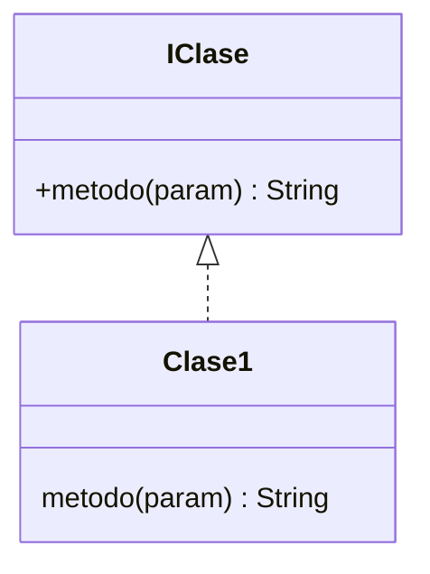

Pagina importante -> https://refactoring.guru/design-patterns/catalog

# Patrones de diseño

- Solucion probada para problemas recurrentes
- La idea es no reinventar la rueda, identificar el problema y aplicar el patron
- Aportan soluciones para determinados problemas de diseño

### Elementos principales
- nombre
- problema
- solucion
- consecuencias

### A que ayudan?
- Favorecer el rehuso
- dos mecanimos
	- Caja blanca -> Herencia, rehuso de codigo -> entramos dentro del codigo
		Caja blanca porque es visible, el hijo conoce completamente lo que tiene el padre y puede agregar codigo
	- Caja negra -> Composicion, agregacion, asociacion -> rehuso de definiciones: nombres de metodos y parametros (delegacion)
		Poder definir un conjunto de metodos sin realmente saber que clase es la que implementa. Hablamos de una interfaz como tal 
	
Priorizamos el uso de la relacion de **Realizacion**, sobre la **Herencia**, lacial nos permite definir interfaces, permitiendo programar hacia la interfaz y no hacia la imprementacion, para darle transparencia al cliente

### Como se implementa una interfaz?

La interfaz es caja negra, porque el cliente sabe qué métodos existen (la firma), pero no sabe ni le importa cómo están implementados. Lo único que le interesa es que cumpla el contrato definido en la interfaz.

## Clasificacion de patrones

| Ámbito | Creación                                           | Estructura                                                            | Comportamiento                                                                                            |
| ------ | -------------------------------------------------- | --------------------------------------------------------------------- | --------------------------------------------------------------------------------------------------------- |
| Clase  | Factory Method                                     | Adapter                                                               | Interpreter · Template Method                                                                             |
| Objeto | Abstract Factory · Builder · Prototype · Singleton | Adapter · Bridge · Composite · Decorator · Facade · Flyweight · Proxy | Chain of Responsability · Command · Iterator · Mediator · Memento · Observer · State · Strategy · Visitor |
- **Creación**: resuelven problemas referidos a la creación de objetos.  
- **Estructura**: combinan clases para resolver estructuras complejas o clases incompatibles y/o se agrega funcionalidad a la clase.  
- **Comportamiento**: resuelven el algoritmo y distribución de responsabilidades entre clases.  

## Patron State

