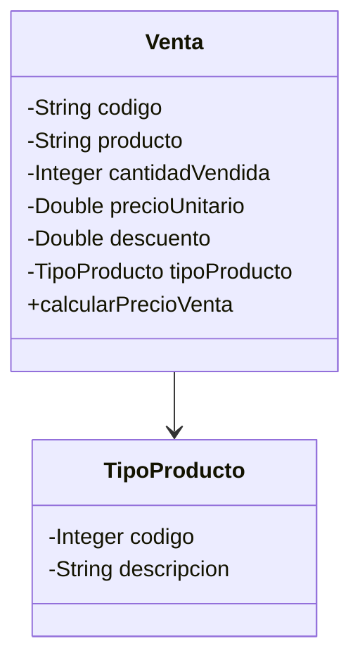

# Enunciado de Practica Colecciones, Streams y otras yerbas

  

## Consideraciones generales

El presente documento tiene un paso a paso que lleva desde la creacion de clases simples sin utilizar herencia, zafaron de eso, pero aca viene otra maldad de toda maldad `😈`. Primero pongamos contexto y despues vamos a los "items" a desarrollar.

  

### Eunciado

  

Una Cafeteria necesita un programa que permita realizar una serie de estadisticas, para eso se va a contar con un estructura simple de objetos que estara representada en un archivo csv llamado [cafelahumedad](cafelahumedad.csv). Cada fila del csv va a producir objetos de la siguiente estructura, muy simple por cierto:

  



### Paso a paso

  

Vale usar todos los conocimiento hasta ahora y si quieren renegar con IA pues adelante (seria piola que no, renegar para aprender es el objetivo)

  

1. Crear un proyecto en JAVA usando Maven, pueden ejecutar el siguiente comando.

    > mvn archetype:generate "-DgroupId=com.frc.isi.csv.colecciones.app" "-DartifactId=csv-colecciones-app" "-Dversion=1.0-SNAPSHOT" "-DarchetypeGroupId=org.apache.maven.archetypes" "-DarchetypeArtifactId=maven-archetype-quickstart" "-DarchetypeVersion=1.5"

  

2. Modificar el archivo pom.xml colcando la dependencia de lombok y que se pueda ejecutar sin necesdad de indicar la ubicacion de la clase App. Les paso lo necesario

``` xml
 <dependency>

        <groupId>org.projectlombok</groupId>

            <artifactId>lombok</artifactId>

        <version>1.18.38</version>

    </dependency>

```
  
```xml

        <plugin>

          <groupId>org.codehaus.mojo</groupId>

          <artifactId>exec-maven-plugin</artifactId>

          <version>3.5.0</version>

          <configuration>

            <mainClass>com.frc.isi.csvstream.app.App</mainClass>

          </configuration>

        </plugin>
```

3. En la carpeta practica del proyecto crear una nueva carpeta llamada resources, dentro compiar este enunciado y crear un subfolder llamado data y dentro de esta carpeta pegar el archivo csv

  

 __Hasta aca facil y sencillo, a embarrarla__ `😈`

  

 4. Vamos a crear un Interfaz Funcional llamada OpcionDeMenu, que sea generica y que por regla tenga el metodo ejecutar que reciba como parametro un contexto (una instancia del objeto que contendra todas las Ventas)

 5. Vamos a crear un clase llama Menu con las siguiente consideraciones

    6. Crear una interfaz que llame IMenu que permita menejar Generics y tenga los siguientes comportamientos

        > void registrarOpcion(int opcion, String textoAMostrar, OpcionDeMenu\<T\> action)

  

        > void invocarAccion(T contexto)

    7. La clase contendra la sigiuente definicion, obviamente manejara Generics como la interfaz y obviamente implementar los metodos de la interfaz IMenu

        > public class Menu\<T\> implements IMenu\<T\>

    8. La clase tendra un unico atributo, una coleccion de tipo __Map__ llamada acciones, idexada por un entero y contendra una instancia de OpcionDeMenu\<T\>

    9. _registrarOpcion_ agrena un elemento a la coleccion

    10. _invocarAccion_ mostrara el menu de opciones. Pista: visualicen el menu y lo pueden hacer usando keySet... sino pueden llevar una coleccion con las opcines, aca tienen la clase.


11. Ahora vamos a los bifes, cumplir el enunciado agregando opciones de menu je

   12. Importar el csv, abrir el archivo que esta dentro del folder, asumiendo que puede haber mas de un archivo csv. Deben ver donde ubicar este comportamiento, __pista: Una clase que contenga la/s colecciones__. Se puede mapear el folder para la lectura de la siguiente manera

        > URL folderPath = App.class.getResource("/data");

      13. Al importar el csv el Tipo de Producto se puede repetir, por lo cual no agregar duplicados del TipoDeProducto, __pista: Map__ y el codigo del tipo de producto es incremental auto generado por el codigo

   14. Mostrar todas la Ventas, como sale del toString, ordenado por nombre del producto, al final mostar la cantidad total vendida y el total recaudado (la suma de los resultados calcularPrecioVenta)

   15. Informar todos los productos cuyo precio de Venta sea mayor al promedio del pecio de venta

   16. Informar todos los productos para un tipo de producto cuya cantidad se mayor a la menor cantidad de productos vendidos

   17. Deben informar el nombre del tipo de producto y cuanto se vendio en total por ese tipo de producto, ordenado por total vendido de mayor a menor.

   18. Generar un informe ordenado por codigo, mostrando todos los datos de la venta,  cuyo descuento sea mayor al 1%, Usen partitionBy

  

A divertirse... y renegar que es la unica manera de aprender

  

### Opcional: conectar a GitLab para guardarlo

1. Crear en GitLab, cuando tengan acceso, un proyecto vacio, no lo inicialicen con el archivo readme

2. En una terminal de VS Code correr el sigiuente comando:

    > git init

3. Luego crear el branch main, para evitar complicaciones

    > git switch --create main

4. Asociar el repo local con el remoto que crearon en GitLab

    > git remote add origin [url del repo]
    
 ---

# Código Completo con flujo de desarrollo

# 0) Preparación del proyecto

## ✅ Crear proyecto Maven

- **Comando**:
    
    ```
    mvn archetype:generate "-DgroupId=com.frc.isi.csv.colecciones.app" "-DartifactId=csv-colecciones-app" "-Dversion=1.0-SNAPSHOT" "-DarchetypeGroupId=org.apache.maven.archetypes" "-DarchetypeArtifactId=maven-archetype-quickstart" "-DarchetypeVersion=1.5"
    ```
    

## ✅ `pom.xml` (dependencias y ejecución)

- **Lombok** (evita boilerplate de getters/setters).
    
- **exec-maven-plugin** apuntando a `com.frc.isi.csv.colecciones.app.App`.
    

**Concepto**: poder correr con `mvn compile exec:java` sin pasar `-Dexec.mainClass`.

---

# 1) Estructura de recursos y CSV

## ✅ Ubicación del CSV

- Carpeta estándar de Maven: `src/main/resources/data/`
    
- **Archivo**: `cafelahumedad.csv`
    
- **Orden real de columnas** (importante):
    
    ```
    Codigo,NombreProducto,TipoProducto,CantidadVendida,PrecioVenta,Descuento
      0          1              2              3            4          5
    ```
    

**Concepto**: Usamos `getResource("/data")` y `getResourceAsStream("/data/archivo.csv")` para que funcione dentro del IDE y también empacado.

---

# 2) Punto de entrada

## ✅ `src/main/java/com/frc/isi/csv/colecciones/app/App.java`

``` java
package com.frc.isi.csv.colecciones.app;  
  
import com.frc.isi.csv.colecciones.app.core.CafeteriaContext;  
import com.frc.isi.csv.colecciones.app.io.CsvImporter;  
import com.frc.isi.csv.colecciones.app.menu.Menu;  
import com.frc.isi.csv.colecciones.app.modelo.Venta;  
import com.frc.isi.csv.colecciones.app.util.Fmt;  
  
import java.util.Comparator;  
import java.util.Map;  
import java.util.Scanner;  
import java.util.stream.Collectors;  
  
/**  
 * Punto de entrada de la app Cafetería. * Ahora: loop simple para elegir varias opciones seguidas. */public class App {  
    public static void main(String[] args) {  
        CafeteriaContext ctx = new CafeteriaContext();  
        Menu<CafeteriaContext> menu = new Menu<>();  
  
        // 1) Importar CSV(s)  
        menu.registrarOpcion(1, "Importar CSV desde /resources/data", c -> {  
            int antes = c.getVentas().size();  
            int agregadas = CsvImporter.importarVentas(c);  
            int despues = c.getVentas().size();  
            System.out.printf("Importación OK. Agregadas: %d (Total ahora: %d)\n", agregadas, despues);  
            // Tip: si corrés dos veces, se duplican ventas (no “des-importamos”).  
            // Si no querés duplicar, podrías limpiar la lista antes de importar.        });  
  
        // 2) Mostrar todas las Ventas ordenadas por producto + totales  
        menu.registrarOpcion(2, "Listar ventas (orden producto) + totales", c -> {  
            if (c.getVentas().isEmpty()) {  
                System.out.println("No hay ventas. Importá primero (opción 1).");  
                return;  
            }  
  
            // Orden por nombre de producto  
            c.getVentas().stream()  
                    .sorted(Comparator.comparing(Venta::getProducto, String.CASE_INSENSITIVE_ORDER))  
                    .forEach(v -> System.out.printf(  
                            "%s | %s | cant=%d | $unit=%.2f | desc=%.2f%% | tipo=%s | total=%s\n",  
                            v.getCodigo(), v.getProducto(), v.getCantidadVendida(),  
                            v.getPrecioUnitario(), v.getDescuento()*100.0,  
                            v.getTipoProducto().getDescripcion(),  
                            Fmt.money(v.calcularPrecioVenta())  
                    ));  
  
            // Totales globales  
            int totalCant = c.getVentas().stream().mapToInt(Venta::getCantidadVendida).sum();  
            double totalRecaudado = c.getVentas().stream().mapToDouble(Venta::calcularPrecioVenta).sum();  
  
            System.out.println("------------------------------------------------");  
            System.out.println("Cantidad total vendida: " + totalCant);  
            System.out.println("Total recaudado: " + Fmt.money(totalRecaudado));  
        });  
  
        // 3) Productos cuyo precio de venta (total por fila) sea > promedio  
        menu.registrarOpcion(3, "Productos con precio de venta > promedio", c -> {  
            if (c.getVentas().isEmpty()) {  
                System.out.println("No hay ventas. Importá primero (opción 1).");  
                return;  
            }  
  
            // Promedio del "precio de venta" por fila (venta total = cant * precio * (1 - desc))  
            double promedio = c.getVentas().stream()  
                    .mapToDouble(Venta::calcularPrecioVenta)  
                    .average()  
                    .orElse(0.0);  
  
            System.out.printf("Promedio de precio de venta: %s%n", Fmt.money(promedio));  
            System.out.println("Productos con total > promedio:");  
  
            c.getVentas().stream()  
                    .filter(v -> v.calcularPrecioVenta() > promedio)  
                    .sorted(Comparator.comparing(Venta::getProducto, String.CASE_INSENSITIVE_ORDER))  
                    .forEach(v -> System.out.printf(  
                            "%s | %-20s | tipo=%-12s | cant=%3d | total=%s%n",  
                            v.getCodigo(), v.getProducto(),  
                            v.getTipoProducto().getDescripcion(),  
                            v.getCantidadVendida(),  
                            Fmt.money(v.calcularPrecioVenta())  
                    ));  
        });  
  
        // 4) Para un tipo elegido, productos con cantidad > mínima global  
        menu.registrarOpcion(4, "Por TIPO elegido: productos con cantidad > mínima global", c -> {  
            if (c.getVentas().isEmpty()) {  
                System.out.println("No hay ventas. Importá primero (opción 1).");  
                return;  
            }  
  
            // Calculamos la cantidad mínima global  
            int minGlobal = c.getVentas().stream()  
                    .mapToInt(Venta::getCantidadVendida)  
                    .min()  
                    .orElse(0);  
  
            // Listamos tipos disponibles para ayudar al usuario  
            System.out.println("Tipos disponibles:");  
            c.getVentas().stream()  
                    .map(v -> v.getTipoProducto().getDescripcion())  
                    .distinct()  
                    .sorted(String.CASE_INSENSITIVE_ORDER)  
                    .forEach(t -> System.out.println(" - " + t));  
  
            // Leemos tipo deseado  
            System.out.print("Ingresá el tipo exactamente como figura arriba: ");  
            Scanner inLocal = new Scanner(System.in);  
            String tipoElegido = inLocal.nextLine().trim();  
  
            // Filtramos por tipo y por cantidad > minGlobal  
            var resultados = c.getVentas().stream()  
                    .filter(v -> v.getTipoProducto().getDescripcion().equalsIgnoreCase(tipoElegido))  
                    .filter(v -> v.getCantidadVendida() > minGlobal)  
                    .sorted(Comparator.comparing(Venta::getProducto, String.CASE_INSENSITIVE_ORDER))  
                    .toList();  
  
            if (resultados.isEmpty()) {  
                System.out.printf("No hay productos del tipo '%s' con cantidad > %d%n", tipoElegido, minGlobal);  
                return;  
            }  
  
            System.out.printf("Mínimo global de cantidad: %d%n", minGlobal);  
            System.out.printf("Productos del tipo '%s' con cantidad > mínimo:%n", tipoElegido);  
            resultados.forEach(v -> System.out.printf(  
                    "%s | %-20s | cant=%3d | total=%s%n",  
                    v.getCodigo(), v.getProducto(), v.getCantidadVendida(), Fmt.money(v.calcularPrecioVenta())  
            ));  
        });  
  
        // 5) Total vendido por TIPO (recaudación), ordenado desc  
        menu.registrarOpcion(5, "Total vendido por TIPO (desc)", c -> {  
            if (c.getVentas().isEmpty()) {  
                System.out.println("No hay ventas. Importá primero (opción 1).");  
                return;  
            }  
  
            // Agrupamos por tipo y sumamos recaudación  
            var porTipo = c.getVentas().stream()  
                    .collect(Collectors.groupingBy(  
                            v -> v.getTipoProducto().getDescripcion(),  
                            Collectors.summingDouble(Venta::calcularPrecioVenta)  
                    ));  
  
            // Ordenamos por total desc y mostramos  
            System.out.println("Recaudación por tipo (mayor → menor):");  
            porTipo.entrySet().stream()  
                    .sorted(Map.Entry.<String, Double>comparingByValue(Comparator.reverseOrder()))  
                    .forEach(e -> System.out.printf("%-15s : %s%n", e.getKey(), Fmt.money(e.getValue())));  
        });  
  
        // 5 alternativo - cantidad en vez de monto recaudado  
//        // 5b) Total de CANTIDAD vendida por TIPO (unidades), ordenado desc  
//        menu.registrarOpcion(55, "Cantidad total vendida por TIPO (desc)", c -> {  
//            if (c.getVentas().isEmpty()) {  
//                System.out.println("No hay ventas. Importá primero (opción 1).");  
//                return;  
//            }  
//  
//            // Agrupamos por tipo de producto y sumamos la cantidad de unidades vendidas  
//            var porTipo = c.getVentas().stream()  
//                    .collect(Collectors.groupingBy(  
//                            v -> v.getTipoProducto().getDescripcion(), // clave: el nombre del tipo  
//                            Collectors.summingInt(Venta::getCantidadVendida) // sumatoria de cantidades  
//                    ));  
//  
//            // Ordenamos el Map resultante por el valor (cantidad) en orden descendente  
//            System.out.println("Cantidad de productos vendidos por tipo (mayor → menor):");  
//            porTipo.entrySet().stream()  
//                    .sorted(Map.Entry.<String, Integer>comparingByValue(Comparator.reverseOrder()))  
//                    .forEach(e -> System.out.printf("%-15s : %d unidades%n", e.getKey(), e.getValue()));  
//        });  
  
        // 6) Ventas con descuento > 1% (partitioningBy) ordenadas por código        menu.registrarOpcion(6, "Ventas con descuento > 1% (ordenadas por código)", c -> {  
            if (c.getVentas().isEmpty()) {  
                System.out.println("No hay ventas. Importá primero (opción 1).");  
                return;  
            }  
  
            var particion = c.getVentas().stream()  
                    .collect(Collectors.partitioningBy(v -> v.getDescuento() > 0.01));  
  
            var conDesc = particion.get(true).stream()  
                    .sorted(Comparator.comparing(Venta::getCodigo, String.CASE_INSENSITIVE_ORDER))  
                    .toList();  
  
            if (conDesc.isEmpty()) {  
                System.out.println("No hay ventas con descuento > 1%.");  
                return;  
            }  
  
            System.out.println("Ventas con descuento > 1% (ordenadas por código):");  
            conDesc.forEach(v -> System.out.printf(  
                    "%s | %-20s | desc=%.2f%% | cant=%3d | $unit=%.2f | total=%s%n",  
                    v.getCodigo(), v.getProducto(), v.getDescuento() * 100.0,  
                    v.getCantidadVendida(), v.getPrecioUnitario(), Fmt.money(v.calcularPrecioVenta())  
            ));  
        });  
  
  
        // Loop de menú simple (permite probar varias opciones sin reiniciar)  
        try (Scanner in = new Scanner(System.in)) {  
            while (true) {  
                menu.registrarOpcion(0, "Salir", x -> {  
                    // no hacemos nada acá; el 0 lo manejamos abajo para cortar el loop  
                });  
  
                menu.invocarAccion(ctx);  
  
                System.out.print("¿Continuar? (0 = salir, otro número = seguir): ");  
                if (in.hasNextInt() && in.nextInt() == 0) {  
                    break;  
                }  
            }        }  
        System.out.println("Fin. ¡Seguimos con el resto de informes!");  
    }  
}
```

**Rol**: `main` de la app. Crea el **contexto** y el **menú**, registra las opciones (1 a 6) y corre en un loop simple.

**Claves**:

- Registra opciones del menú con lambdas (interfaces funcionales).
    
- Opción 1: **importar CSV** y mostrar resumen.
    
- Opción 2: **listar ventas** (orden por producto) + totales.
    
- Opción 3: **productos con total > promedio**.
    
- Opción 4: **filtrar por tipo** con **cantidad > mínima global**.
    
- Opción 5: **total vendido por tipo** (recaudación) **desc**.
    
- Opción 6: **partitioningBy** (descuento > 1%) y listado ordenado por **código**.
    

**Conceptos**: Streams, Collectors, ordenamientos, agrupaciones, filtros, promedio.

---

# 3) Modelo de dominio (simple, sin herencia)

## ✅ `src/main/java/com/frc/isi/csv/colecciones/app/modelo/TipoProducto.java`

``` java
package com.frc.isi.csv.colecciones.app.modelo;  
  
import lombok.*;  
  
@Data @AllArgsConstructor @NoArgsConstructor  
public class TipoProducto {  
    private Integer codigo;       // autoincremental que asignaremos al importar  
    private String descripcion;   // ej: "Café", "Medialuna", etc.  
}
```
**Atributos**:

- `Integer codigo` (autoincremental)
    
- `String descripcion`
    

**Usos**:

- Evitar duplicados por descripción (case-insensitive/trim).
    
- Mostrar el nombre del tipo en informes.
    

---

## ✅ `src/main/java/com/frc/isi/csv/colecciones/app/modelo/Venta.java`

``` java
package com.frc.isi.csv.colecciones.app.modelo;  
  
import lombok.*;  
  
@Data @AllArgsConstructor @NoArgsConstructor  
public class Venta {  
    private String codigo;           // id de la venta (string del CSV)  
    private String producto;         // nombre del producto  
    private Integer cantidadVendida; // unidades  
    private Double precioUnitario;   // $ por unidad  
    private Double descuento;        // proporción (ej: 0.05 = 5%)  
    private TipoProducto tipoProducto;  
  
    public double calcularPrecioVenta() {  
        // En criollo: total bruno - descuento  
        // total = cantidad * unitario; aplicar (1 - descuento)        return cantidadVendida * precioUnitario * (1 - descuento);  
    }  
}

```

**Atributos**:

- `String codigo` (de la venta)
    
- `String producto`
    
- `Integer cantidadVendida`
    
- `Double precioUnitario`
    
- `Double descuento` (fracción: 0.05 = 5%)
    
- `TipoProducto tipoProducto`
    

**Método clave**:

- `double calcularPrecioVenta()`: `cantidad * precioUnitario * (1 - descuento)`
    

**Concepto (en criollo)**: “lo que se recaudó” por esa fila.

---

# 4) Contexto de la aplicación (dónde viven las colecciones)

## ✅ `src/main/java/com/frc/isi/csv/colecciones/app/core/CafeteriaContext.java`

``` java
package com.frc.isi.csv.colecciones.app.core;  
  
import com.frc.isi.csv.colecciones.app.modelo.TipoProducto;  
import com.frc.isi.csv.colecciones.app.modelo.Venta;  
import lombok.Getter;  
  
import java.util.*;  
  
/**  
 * "Caja" donde guardamos las colecciones y el estado de la app. * Acá van las ventas y los tipos de producto. */@Getter  
public class CafeteriaContext {  
  
    // Lista "maestra" de ventas (se alimentará al importar CSV)  
    private final List<Venta> ventas = new ArrayList<>();  
  
    // Diccionario para no duplicar tipos de producto (clave: descripción normalizada)  
    private final Map<String, TipoProducto> tiposPorDescripcion = new HashMap<>();  
  
    // Para generar códigos autoincrementales de TipoProducto  
    private int siguienteCodigoTipo = 1;  
  
    /**  
     * Obtiene (o crea) un TipoProducto por descripción, sin duplicar.     * Normalizamos la descripción a lower-case/trim para evitar duplicados por mayúsculas/espacios.     */    public TipoProducto getOrCreateTipo(String descripcionOriginal) {  
        String key = normalizar(descripcionOriginal);  
        return tiposPorDescripcion.computeIfAbsent(key, k -> {  
            TipoProducto t = new TipoProducto(siguienteCodigoTipo++, descripcionOriginal.trim());  
            return t;  
        });  
    }  
  
    private String normalizar(String s) {  
        return s == null ? "" : s.trim().toLowerCase(Locale.ROOT);  
    }  
}
```

**Rol**: “caja” de estado de la app.

**Atributos**:

- `List<Venta> ventas`
    
- `Map<String, TipoProducto> tiposPorDescripcion` (clave: descripción normalizada)
    
- `int siguienteCodigoTipo` (autoincremental)
    

**Método clave**:

- `TipoProducto getOrCreateTipo(String descripcionOriginal)`:  
    normaliza (lower/trim), busca en el `Map`, si no existe **crea** con `codigo` autoincremental y lo guarda.
    

**Concepto**: Evitar tipos duplicados al importar de CSV.

---

# 5) Menú genérico (interfaces y clase)

## ✅ `src/main/java/com/frc/isi/csv/colecciones/app/menu/OpcionDeMenu.java`

```java
package com.frc.isi.csv.colecciones.app.menu;  
  
@FunctionalInterface  
// el <T> indica que puede trabajar con cualquier tipo que se le indique  
public interface OpcionDeMenu<T> {  
    void ejecutar(T contexto) throws Exception;  
}
```

**Interfaz funcional**:

- `void ejecutar(T contexto) throws Exception;`
    

**Concepto**: cada opción del menú es una lambda que “opera” sobre el **contexto**.

---

## ✅ `src/main/java/com/frc/isi/csv/colecciones/app/menu/IMenu.java`

``` java
package com.frc.isi.csv.colecciones.app.menu;  
  
public interface IMenu<T> {  
    void registrarOpcion(int opcion, String textoAMostrar, OpcionDeMenu<T> action);  
    void invocarAccion(T contexto);  
    // mostrará menú, leerá opción y ejecutará  
}
```

**Contrato**:

- `registrarOpcion(int opcion, String texto, OpcionDeMenu<T> action)`
    
- `invocarAccion(T contexto)`
    

---

## ✅ `src/main/java/com/frc/isi/csv/colecciones/app/menu/Menu.java`

```java

package com.frc.isi.csv.colecciones.app.menu;  
  
import java.util.*;  
import java.util.stream.Collectors;  
  
/**  
 * Menú genérico, imprime opciones, lee la elección con Scanner y ejecuta la acción. * Guarda todoo en un único Map<Integer, MenuEntry<T>> llamado "acciones".  
 */public class Menu<T> implements IMenu<T> {  
  
    // Usamos LinkedHashMap para preservar el orden de registro (se ve prolijo al imprimir)  
    private final Map<Integer, MenuEntry<T>> acciones = new LinkedHashMap<>();  
  
    // Registro de una opción en el menú  
    @Override  
    public void registrarOpcion(int opcion, String textoAMostrar, OpcionDeMenu<T> action) {  
        // Si se repite la clave, la pisamos (decisión simple). Podrías validar y rechazar duplicados.  
        acciones.put(opcion, new MenuEntry<>(textoAMostrar, action));  
    }  
  
    // Muestra el menú, lee la opción y ejecuta la acción asociada (si existe)  
    @Override  
    public void invocarAccion(T contexto) {  
        // Scanner local para lectura por consola (cerrar NO, así no cerramos System.in)  
        Scanner in = new Scanner(System.in);  
  
        try {  
            // Armamos un listado ordenado por clave (por si alguien registró en desorden)  
            String menuStr = acciones.entrySet().stream()  
                    .sorted(Map.Entry.comparingByKey())  
                    .map(e -> String.format("%d ---------------- %s", e.getKey(), e.getValue().texto))  
                    .collect(Collectors.joining("\n"));  
  
            System.out.println("\n=== MENÚ ===");  
            System.out.println(menuStr);  
            System.out.print("Elegí una opción: ");  
  
            // Intentamos leer un entero; si no, informamos y salimos  
            if (!in.hasNextInt()) {  
                System.out.println("Opción inválida (no es número).");  
                return;  
            }  
            int opcionElegida = in.nextInt();  
  
            // Buscamos la opción  
            MenuEntry<T> entry = acciones.get(opcionElegida);  
            if (entry == null) {  
                System.out.println("Opción inexistente.");  
                return;  
            }  
  
            // Ejecutamos la acción (con manejo básico de excepción para no reventar la app)  
            try {  
                entry.action.ejecutar(contexto);  
            } catch (Exception e) {  
                System.out.println("Error ejecutando la opción: " + e.getMessage());  
                e.printStackTrace(System.out);  
            }  
  
        } finally {  
            // No cerramos el Scanner (cerrar System.in suele traer efectos no deseados en apps de consola)  
        }  
    }  
    /**  
     * Estructura interna para guardar el "texto a mostrar" y la "acción a ejecutar".     * Está anidada para encapsular y no "ensuciar" el paquete con clases sueltas.     */    private static class MenuEntry<T> {  
        final String texto;  
        final OpcionDeMenu<T> action;  
        MenuEntry(String texto, OpcionDeMenu<T> action) {  
            this.texto = texto;  
            this.action = action;  
        }  
    }}
```

**Implementación**:

- Único atributo: `Map<Integer, MenuEntry<T>> acciones` (LinkedHashMap para mantener orden).
    
- Muestra menú, lee opción con `Scanner`, **ejecuta** la acción encontrada.
    

**Nota**: `MenuEntry` es una clase interna con `texto` + `action`, para cumplir la regla de “un único Map”.

**Conceptos**: Genéricos, lambdas, `Scanner`, `Map` como diccionario de acciones.

---

# 6) Importador CSV

## ✅ `src/main/java/com/frc/isi/csv/colecciones/app/io/CsvImporter.java`

```java

package com.frc.isi.csv.colecciones.app.io;  
  
import com.frc.isi.csv.colecciones.app.App;  
import com.frc.isi.csv.colecciones.app.core.CafeteriaContext;  
import com.frc.isi.csv.colecciones.app.modelo.TipoProducto;  
import com.frc.isi.csv.colecciones.app.modelo.Venta;  
  
import java.io.BufferedReader;  
import java.io.InputStreamReader;  
import java.net.URL;  
import java.nio.file.*;  
import java.util.List;  
import java.util.Objects;  
import java.util.stream.Collectors;  
  
/**  
 * Lee TODOS los .csv dentro de /resources/data y * crea objetos Venta + TipoProducto (sin duplicar tipos). * * En criollo: * - Encuentra la carpeta /data del classpath. * - Recorre todos los archivos .csv que haya. * - Por cada línea (salteando encabezado) arma la Venta y vincula su TipoProducto *   usando el diccionario del contexto (getOrCreateTipo). */// ... package/imports iguales  
  
public class CsvImporter {  
  
    public static int importarVentas(CafeteriaContext ctx) throws Exception {  
        URL dataUrl = App.class.getResource("/data");  
        if (dataUrl == null) {  
            throw new IllegalStateException("No se encontró la carpeta /resources/data en el classpath.");  
        }  
  
        Path dataPath = Paths.get(dataUrl.toURI());  
        List<Path> csvs = Files.list(dataPath)  
                .filter(p -> p.getFileName().toString().toLowerCase().endsWith(".csv"))  
                .collect(Collectors.toList());  
  
        int totalAgregadas = 0;  
  
        for (Path csv : csvs) {  
            try (BufferedReader br = new BufferedReader(new InputStreamReader(  
                    Objects.requireNonNull(App.class.getResourceAsStream("/data/" + csv.getFileName()))  
            ))) {  
                String header = br.readLine(); // salteo encabezado  
  
                String linea;  
                int numLinea = 1; // para debug  
                while ((linea = br.readLine()) != null) {  
                    numLinea++;  
                    linea = linea.trim();  
                    if (linea.isEmpty()) continue;  
  
                    // Tu orden: Codigo,NombreProducto,TipoProducto,CantidadVendida,PrecioVenta,Descuento  
                    String[] c = linea.split(",", -1);  
                    if (c.length < 6) {  
                        System.out.printf("Línea %d ignorada (columnas insuficientes): %s%n", numLinea, linea);  
                        continue;  
                    }  
  
                    try {  
                        // ---- mapeo correcto según tu CSV ----  
                        String codigo      = c[0].trim(); // String  
                        String producto    = c[1].trim(); // String  
                        String tipoDesc    = c[2].trim(); // String (p.ej. "Infusiones")  
                        int cantidad       = Integer.parseInt(c[3].trim());     // int  
                        double precioUnit  = parseDoubleFlexible(c[4].trim());  // double  
                        double descuento   = parseDescuentoFlexible(c[5].trim()); // double fraccional  
  
                        // No duplicar tipos: lo pide el enunciado → usamos el diccionario del contexto                        TipoProducto tipo = ctx.getOrCreateTipo(tipoDesc);  
  
                        Venta v = new Venta(codigo, producto, cantidad, precioUnit, descuento, tipo);  
                        ctx.getVentas().add(v);  
                        totalAgregadas++;  
  
                    } catch (NumberFormatException nfe) {  
                        System.out.printf("Línea %d con datos inválidos: %s (error: %s)%n",  
                                numLinea, linea, nfe.getMessage());  
                    }  
                }            }        }        return totalAgregadas;  
    }  
  
    // Acepta “12,34” o “12.34”  
    private static double parseDoubleFlexible(String s) {  
        if (s == null || s.isBlank()) return 0.0;  
        return Double.parseDouble(s.replace(",", "."));  
    }  
  
    // Acepta “0.05”, “5”, “5%”, “5,0%”  
    //  - con % → divide por 100    //  - si es > 1 y no tiene % (ej. 5) asumimos “5%” → 0.05    private static double parseDescuentoFlexible(String s) {  
        if (s == null || s.isBlank()) return 0.0;  
        String clean = s.trim().replace("%", "").replace(",", "."); // “5%” → “5”  
        double v = Double.parseDouble(clean);  
        if (s.contains("%")) return v / 100.0;  
        return (v > 1.0) ? v / 100.0 : v; // si pusieron 5, lo tomamos como 5%  
    }  
}
```

**Rol**: leer **todos** los `.csv` de `/resources/data` y poblar `CafeteriaContext`.

**Flujo**:

1. `URL dataUrl = App.class.getResource("/data");` → carpeta de datos.
    
2. `Files.list(...)` → lista de CSV.
    
3. Por cada archivo:
    
    - `getResourceAsStream("/data/" + nombre)` → `BufferedReader`.
        
    - Ignora encabezado (primera línea).
        
    - Para cada línea: `split(",", -1)`; **mapea según tu orden**:
        
        - `codigo = c[0]`
            
        - `producto = c[1]`
            
        - `tipoDesc = c[2]`
            
        - `cantidad = Integer.parseInt(c[3])`
            
        - `precioUnit = parseDoubleFlexible(c[4])`
            
        - `descuento = parseDescuentoFlexible(c[5])`  
            (acepta `0.05`, `5`, `5%`, `5,0%`)
            
    - `TipoProducto tipo = ctx.getOrCreateTipo(tipoDesc)`
        
    - `ctx.getVentas().add(new Venta(...))`
        

**Helpers**:

- `parseDoubleFlexible`: soporta coma o punto decimal.
    
- `parseDescuentoFlexible`: soporta fracción o porcentaje.
    

**Conceptos**: IO con classpath, robustez de parseo, evitar duplicados, autoincremento.

---

# 7) Utilidad de formato (opcional, para imprimir lindo) - No hace falta

## ✅ `src/main/java/com/frc/isi/csv/colecciones/app/util/Fmt.java`

```java
package com.frc.isi.csv.colecciones.app.util;  
  
import java.text.NumberFormat;  
import java.util.Locale;  
  
// ESTO ES OPCIONAL - SOLO ESTETICO DE CHATGPT  
/** Formateadores simples para que los informes se lean lindos. */  
public class Fmt {  
    private static final NumberFormat MON = NumberFormat.getCurrencyInstance(new Locale("es", "AR"));  
    private static final NumberFormat NUM = NumberFormat.getNumberInstance(new Locale("es", "AR"));  
  
    public static String money(double v) { return MON.format(v); }  
    public static String num(double v)   { return NUM.format(v); }  
}

```

**Rol**: formatear dinero y números con `Locale("es", "AR")`.

**Usos**: en listados, totales, reporte por tipo.

---

# 8) Opciones del Menú (informes con Streams)

> Todas viven en **`App.java`** cuando registrás las opciones.

## ✅ Opción 1 — Importar CSV

- Llama a `CsvImporter.importarVentas(ctx)`.
    
- Muestra cantidad agregada y total resultante.
    

**Idea**: si la corrés dos veces, duplica ventas (se puede limpiar antes si querés).

---

## ✅ Opción 2 — Listar ventas + totales

- Ordena por **producto** (`Comparator.comparing(..., CASE_INSENSITIVE_ORDER)`).
    
- Imprime líneas con: código, producto, tipo, cant, $unit, desc%, total (fmt).
    
- Totales:
    
    - `cantidad total`: `mapToInt(Venta::getCantidadVendida).sum()`
        
    - `recaudado total`: `mapToDouble(Venta::calcularPrecioVenta).sum()`
        

**Conceptos**: ordenamiento, `forEach`, `mapToInt/mapToDouble`.

---

## ✅ Opción 3 — Productos con total > promedio

- `promedio = ventas.stream().mapToDouble(Venta::calcularPrecioVenta).average().orElse(0)`
    
- Filtro: `v.calcularPrecioVenta() > promedio`
    
- Ordena y lista.
    

**Concepto**: estadística + filtro por umbral.

---

## ✅ Opción 4 — Tipo elegido + cantidad > mínima global

- `minGlobal = ventas.stream().mapToInt(Venta::getCantidadVendida).min().orElse(0)`
    
- Pide por consola un **tipo** (muestra los disponibles con `distinct().sorted()`).
    
- Filtra por `tipo == elegido` **y** `cantidad > minGlobal`.
    
- Ordena y lista.
    

**Concepto**: combinación de filtros + lectura de input.

---

## ✅ Opción 5 — Total vendido por tipo (desc)

- `groupingBy(tipoDescripcion, summingDouble(Venta::calcularPrecioVenta))`
    
- Ordena por valor **descendente** y lista: `tipo : $monto`.
    

**Concepto**: `groupingBy` + `summingDouble` + orden por valor.

---

## ✅ Opción 6 — `partitioningBy` descuento > 1%

- `partitioningBy(v -> v.getDescuento() > 0.01)`
    
- Toma el grupo `true` y lo ordena por **código**.
    
- Lista con: código, producto, desc%, cant, $unit, total.
    

**Concepto**: particionar por predicado booleano.

---

# 9) Ejecución y prueba

## ✅ Comando

```
mvn -q compile exec:java
```

## ✅ Secuencia típica

1. **1** → importar (ver resumen).
    
2. **2** → listar + totales.
    
3. **3** → mayor a promedio.
    
4. **4** → elegir tipo + filtrar por cantidad > min global.
    
5. **5** → total por tipo (desc).
    
6. **6** → ventas con desc > 1% (ordenadas por código).
    
7. **0** → salir (o cortar el loop cuando te pregunte).
    

---

# 10) Cosas que resolvimos (pitfalls y decisiones)

- **Orden de columnas**: nos ajustamos a tu CSV (evitó el `NumberFormatException` con “Infusiones”).
    
- **Separador decimal**: aceptamos **coma o punto** (`parseDoubleFlexible`).
    
- **Descuento**: aceptamos fracción (`0.05`), porcentaje (`5%`) o número suelto (`5` ⇒ 5%).
    
- **Tipos duplicados**: usamos `Map` en el **contexto** con **descripción normalizada**.
    
- **Autoincremental** para `TipoProducto.codigo`: variable `siguienteCodigoTipo`.
    
- **Menú genérico**: `Menu<T>` con un **único `Map`** interno (texto+acción).
    
- **Impresiones**: helper `Fmt` para ARS bonito.
    

---

# 11) Próximos pasos (si querés dejarlo redondo)

- **Agregar tests JUnit**:
    
    - `Venta.calcularPrecioVenta()`.
        
    - Reporte por tipo (que sume bien).
        
    - Filtro de la Opción 3 (casos borde).
        
- **Evitar duplicar ventas al reimportar**:
    
    - Limpiar `ctx.getVentas()` antes de importar, o
        
    - Cargar en una lista temporal y preguntar si reemplazás.
        
- **OpenCSV** (si querés robustez de comillas y separadores complejos).
    
- **Persistencia** (opcional): exportar resultados a CSV/JSON.
    

---
